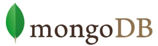

## Tipos de bases de datos
1. **Bases de datos clave – valor**

- Cassandra 
- BigTable o Hbase

    Desde <https://www.acens.com/wp-content/images/2014/02/bbdd-nosql-wp-acens.pdf> 

2. **Bases de datos documentales**

- MongoDB o CouchDB

    Desde <https://www.acens.com/wp-content/images/2014/02/bbdd-nosql-wp-acens.pdf> 

### Ejemplos de bases de datos NoSQL

### **Apache Cassandra**

Se trata de una base de datos creada por Apache del tipo **clave–valor**.
Dispone de un lenguaje propio para realizar consultas CQL (Cassandra Query Language). Cassandra es una
aplicación Java por lo que puede correr en cualquier plataforma que cuente con la JVM.

Desde <https://www.acens.com/wp-content/images/2014/02/bbdd-nosql-wp-acens.pdf> 

### **Redis**

Se trata de una base de datos creada por Salvatore Sanfilippo y Pieter Noordhuis y está apoyado por
VMWare. Se trata de una base de datos del tipo clave–valor. Se puede imaginar como un array gigante en
memoria para almacenar datos, datos que pueden ser cadenas, hashes, conjuntos de datos o listas.
Tiene la ventaja de que sus operaciones son atómicas y persistentes. Por ponerle una pega, Redis no
permite realizar consultas, sólo se puede insertar y obtener datos, además de las operaciones comunes
sobre conjuntos (diferencia, unión e inserción).
Creado en ANSI C, por lo tanto es compatible y funciona sin problemas en sistemas Unix, Linux y sus
derivados, Solaris, OS/X sin embargo no existe soporte oficial para plataformas Windows.

Desde <https://www.acens.com/wp-content/images/2014/02/bbdd-nosql-wp-acens.pdf> 

### **MongoDB**

Se trata de una base de datos creada por 10gen del tipo orientada a documentos, de esquema libre, es
decir, que cada entrada puede tener un esquema de datos diferente que nada tenga que ver con el resto
de registros almacenados. Es bastante rápido a la hora de ejecutar sus operaciones ya que está escrito en
lenguaje C++.
Para el almacenamiento de la información, utiliza un sistema propio de documento conocido con el
nombre BSON, que es una evolución del conocido JSON pero con la peculiaridad de que puede almacenar
datos binarios.

Desde <https://www.acens.com/wp-content/images/2014/02/bbdd-nosql-wp-acens.pdf> 

### **CouchDB**

Se trata de un sistema creado por Apache y escrito en lenguaje Erlang que funciona en la mayoría de
sistemas POSIX, incluyendo GNU/LINUX y OSX, pero no así en sistemas Windows.
Como características más importantes cabe destacar el uso de Restfull HTTP API como interfaz y JavaScript
como principal lenguaje de interacción. Para el almacenamiento de los datos se utiliza archivos JSON.
Permite la creación de vistas, que son el mecanismo que permite la combinación de documentos para
retornar valores de varios documentos, es decir, CouchDB permite la realización de las operaciones JOIN
típicas de SQL.

Desde <https://www.acens.com/wp-content/images/2014/02/bbdd-nosql-wp-acens.pdf> 

## SQL o NoSQL 

Algunas de las razones que nos pueden llevar a decantarnos por el uso de las bases de datos NoSQL en
lugar de las clásicas SQL son:
- Cuando el volumen de los datos crece muy rápidamente en momentos puntuales, pudiendo llegar a
superar el Terabyte de información.
- Cuando la escalabilidad de la solución relacional no es viable tanto a nivel de costes como a nivel
técnico.
- Cuando tenemos elevados picos de uso del sistema por parte de los usuarios en múltiples
ocasiones.
- Cuando el esquema de la base de datos no es homogéneo, es decir, cuando en cada inserción de
datos la información que se almacena puede tener campos distintos.

Desde <https://www.acens.com/wp-content/images/2014/02/bbdd-nosql-wp-acens.pdf> 

Consejo: **EQUILIBRIO** _entre Integridad de los Datos 
y la Eficiencia de la Base de Datos._
