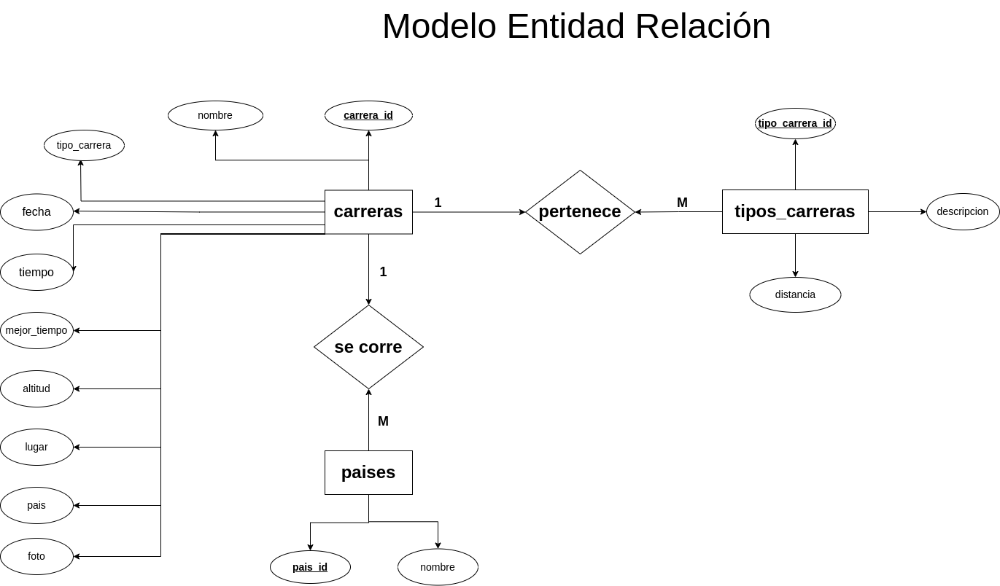
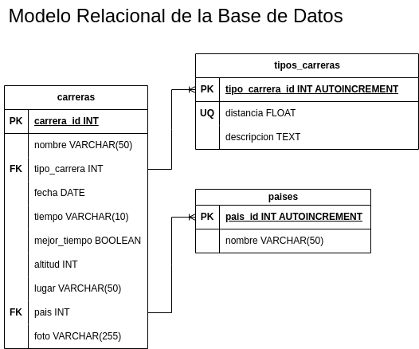

## Reglas para normalizar un modelo existente desde cero

1. Identificar las entidades del sistema.✔️
1. Identificar los atributos de las entidades.✔️
1. Identificar llaves primarias y foráneas.✔️
1. Asignar una nomenclatura adecuada a las entidades y sus atributos.✔️
1. Identificar las entidades pivote del sistema.✔️
1. Identificar los catálogos del sistema.✔️
1. Identificar los tipos de relaciones del sistema.✔️
1. Crear el Modelo Entidad-Relación del Sistema.✔️
1. Crear el Modelo Relacional de la base de datos del sistema.✔️
1. Identificar los tipos de dato de los atributos de las entidades del sistema.✔️
1. Identificar los atributos que puedan ser únicos en el sistema.✔️
1. Identificar las reglas de negocio (Operaciones CRUD) del sistema.✔️

## Glosario

- **PK**: _Primary key_
- **FK**: _Foreign Key_
- **UQ**: _Unique Attribute_
- **ED**: Entidad de Datos
- **EP**: Entidad Pivote
- **EC**: Entidad Catalogo

## Ejemplo: Registro de maratones

1. Listado de Entidades:

### carreras **(ED)**

- carrera_id **(PK)**
- nombre
- tipo_carrera **(FK)**
- fecha
- tiempo
- mejor_tiempo
- altitud
- lugar
- pais **(FK)**
- foto

### tipos_carreras **(EC)**

- tipo_carrera_id **(PK)**
- descripcion
- distancia **(UK)**

### paises **(EC)**

- pais_id **(PK)**
- Nombre

## Relaciones:

1. Una **carrera** _pertenece_ a un tipo de carrera. (_1 a M_)
1. Una **carrera** _se corre_ en un pais. (_1 a M_)

## Diagramas

### Modelo Entidad - Relación

### Modelo Relacional

## Reglas de negocio (Operaciones CRUD)

### carreras

1. Crear una carrera.
1. Leer el registro de una(s) carrera(s) dada una condición en particular.
1. Leer todos los registros de la entidad carreras.
1. Actualizar los datos de una carrera dada un condición en particular.
1. Eliminar los datos de una carrera dada una condición en particular.

### tipos_carreras

1. Todos los valores del atributo distancia, deberan estar expresados en _km_ y no se podrán repetir.
1. Crear un tipo de carrera.
1. Leer el registro de uno(s) tipo(s) de carrera(s) dada una condición en particular.
1. Leer todos los registros de la entidad tipos_carreras.
1. Actualizar los datos de un tipo de carrera dada un condición en particular.
1. Eliminar los datos de un tipo de carrera dada una condición en particular.

### paises

1. Crear el registro un pais.
1. Leer el registro de uno o más paises dada una condición en particular.
1. Actualizar los datos de un país dada una condición en particular.
1. Eliminar los datos de un país dada una condición en particular.
