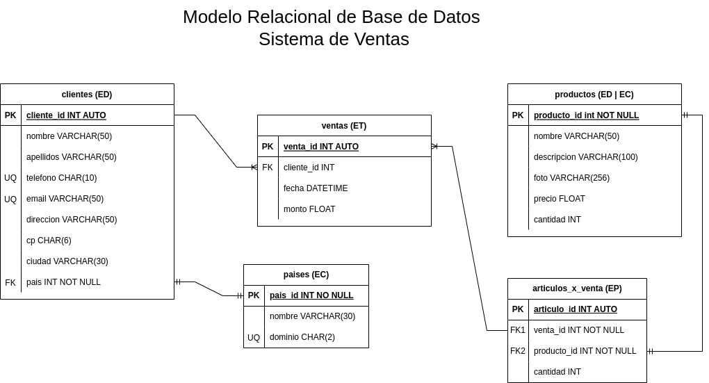

# Ventas

## Listado de Entidades

### clientes **(ED)**

- cliente_id **(PK)**
- nombre
- apellidos
- telefono **(UQ)**
- email **(UQ)**
- direccion
- cp
- ciudad
- pais_id **(FK)**

### productos **(ED|EC)**

- producto_id **(PK)**
- nombre
- descripcion
- foto
- precio
- cantidad

### ventas **(ET)**

- venta_id **(PK)**
- cliente_id **(FK)**
- fecha
- monto

### articulos_x_venta **(EP)** <!-- Vincula la información de 2 o más tablas -->

- articulo_id **(PK)**
- venta_id **(FK)**
- producto_id **(FK)**
- cantidad

### paises **(EC)**

- pais_id **(PK)**
- nombre
- dominio **(UQ)**

## Relaciones

1. Un **cliente** pertenece **país** (_1 - 1_)
1. Un **cliente** genera **venta** (_1 - M_)
1. Una **venta** posee **artículo** (_1 - M_)
1. Un **articulo** es un **producto** (_1 - 1_)

## Diagramas

### Modelo Relacional de la BD

## Reglas de Negocio

### clientes

1. Crear un cliente
1. Consultar todos los clientes
1. Consultar un cliente en particular
1. Actualizar un cliente
1. Eliminar un cliente

### productos

1. Crear un producto
1. Consultar todos los productos
1. Consultar un producto en particular
1. Actualizar un producto
1. Eliminar un producto
1. Afectar la cantidad de productos en inventario cuando se efectue una venta

### ventas

1. Crear una venta
1. Consultar todas las ventas
1. Consultar una venta en particular
1. Consultar todas las ventas de un cliente
1. Consultar todas las ventas de un producto
1. Actualizar una venta
1. Eliminar una venta
