# APUNTES DEL ESTÁNDAR SQL

# Contenido

1. [TIPOS DE SENTENCIAS EN SQL](#tipos-de-sentencias-en-sql)
1. [COMENTARIOS](#comentarios)
1. [CREAR USUARIO](#crear-usuario)
   - [Iniciar sesión con el usuario](#iniciar-sesión-con-el-usuario)
   - [Asignar privilegios a un usuario](#asignar-privilegios-a-un-usuario)
   - [Mostrar privilegios de un usuario](#mostrar-privilegios-de-un-usuario)
   - [Revocar todos los permisos a un usuario](#revocar-todos-los-permisos-a-un-usuario)
   - [Eliminar un usuario](#eliminar-un-usuario)
1. [CREAR TABLAS](#crear-tablas)
   - [Mostrar las tablas existentes](#mostrar-las-tablas-existentes)
   - [COUNT](#count)
   - [IN](#in)
   - [Describir las características de una tabla](#describir-las-características-de-una-tabla)
   - [Modificar (ALTER) una tabla](#modificar-alter-una-tabla)
1. [RENOMBRAR UNA TABLA](#renombrar-una-tabla)
1. [ELIMINAR (DROP) UNA TABLA](#eliminar-drop-una-tabla)
1. [OPERACIONES CRUD](#operaciones-crud)
   - [Insertar (INSERT)](#insertar-insert)
   - [Mostrar registros (SELECT)](#mostrar-registros-select)
   - [Comodin (LIKE) - Búsquedas de Patrones](#comodin-like---búsquedas-de-patrones)
   - [Operadores Relacionales](#operadores-relacionales)
1. [OPERACIONES ARITMETICAS](#operaciones-aritmeticas)
1. [FUNCIONES MATEMATICAS](#funciones-matematicas)
   - [Colummnas calculadas](#columnas-calculadas)
1. [FUNCIONES DE AGRUPAMIENTO](#funciones-de-agrupamiento)
1. [RELACIONES ENTRE TABLAS](#relaciones-entre-tablas)
   - [Como modificar un CONSTRAINT](#como-modificar-un-constraint)
1. [Practica clausula GROUP BY](#practica-clausula-group-by)
   - [HAVING](#having)
   - [DISTINCT](#distinct)
   - [ORDER](#order)
1. [INDICES](#indices)
   - [TABLA INDEXADA VS NO INDEXADA](#tabla-indexada-vs-no-indexada)
   - [Definir un indice](#definir-un-indice)
   - [INDICE FULL TEXT](#indice-full-text)
   - [APLICAR INDICES A UNA TABLA EXISTENTE](#aplicar-indices-a-una-tabla-existente)
   - [Añadir atributo de campo único a una columna de una tabla existente](#añadir-atributo-de-campo-único-a-una-columna-de-una-tabla-existente)
   - [Añadir un index (_común y corriente_) a una columna de una tabla existente](#añadir-un-index-común-y-corriente-a-una-columna-de-una-tabla-existente)
   - [Añadir un index FULLTEX a una tabla existente](#añadir-un-index-fulltex-a-una-tabla-existente)
   - [ELIMINAR INDICES](#eliminar-indices)
1. [JOINS SQL](#joins-sql)
   - [Combinación Interna (INNER JOIN)](#combinación-interna-inner-join)
   - [Combinación Externa (OUTER JOIN)](#combinación-externa-outer-join)
   - [RIGHT OUTER JOIN - RIGHT JOIN](#right-outer-join---right-join)
1. [VISTA](#vista)
1. [MOTORES DE BASES DE DATOS](#motores-de-bases-de-datos)
1. [JUEGO DE CARÁCTERES EN LA BASE DE DATOS](#juego-de-carácteres-en-la-base-de-datos)
1. [RESTRICCIONES](#restricciones)
1. [TRANSACCIONES](#transacciones)
1. [LIMIT](#limit)
1. [FUNCIONES DE ENCRIPTACION](#transacciones)
1. [PROCEDIMIENTOS ALMACENADOS](#procedimientos-almacenados)
1. [DISPARADORES](#disparadores-triggers)

## TIPOS DE SENTENCIAS EN SQL

**Data Definition Language** (DDL): CREATE, ALTER, DROP, TRUNCATE.

**_Ejemplo 1 :_**

    SHOW DATABASES;

    CREATE DATABASE curso_sql;

    CREATE DATABASE IF NOT EXISTS curso_sql;

    DROP DATABASE curso_sql;

    DROP DATABASE IF EXISTS curso_sql;

**Data Manipulation Language** (DML): SELECT, INSERT, UPDATE, DELETE.
**Data Control Language (DCL)**: GRANT, REVOKE.
**Transation Control Language** (TCL): (COMMIT, ROLLBACK, SET TRANSACTION).

[☝️](#contenido)

---

## COMENTARIOS

    -- Comentario en una línea SQL

    /*
    Comentario
    de varias
    líneas

    SQL, NO distingue entre MAYÚSCULAS y minúsculas pero:

    Comando y palabras reservadas de SQL van en MAYÙSCULAS.
    Nombres de objetos y datos van en minúsculas con _snake_case_.
    Para strings usar comillas simples (`''`).
    Todas las sentencias terminan con punto y coma (`;`).
    */

[☝️](#contenido)

---

## CREAR USUARIO

> `CREATE USER 'climaco'@'localhost' IDENTIFIED BY 'Padre1984#';`

### **Iniciar sesión con el usuario**

> `mysql -u climaco -p`

### **Asignar privilegios a un usuario**

> `GRANT ALL PRIVILEGES ON para_climaco TO 'climaco'@'localhost';`

> ![**Ojo**]
>
> _Si pide seleccionar la base de datos, entonces ejecutar:_
>
> `USE nombre_base_de_datos;`

Si se esta trabajando en remoto, actualizar privilegios:

> `FLUSH PRIVILEGES;`

### **Mostrar privilegios de un usuario**

> `SHOW GRANTS FOR 'climaco'@'localhost';`

### **Revocar todos los permisos a un usuario**

> `REVOKE ALL. GRANT OPTION FROM 'climaco'@'localhost';`

### **Eliminar un usuario**

> `DROP USER 'climaco'@'localhost';`

[☝️](#contenido)

---

## CREAR TABLAS

**_Ejemplo 2 :_**

    CREATE TABLE usuarios (
      nombre VARCHAR(50),
      correo VARCHAR(50)
    );

**_Ejemplo 3 :_**

    CREATE TABLE usuarios (
        usuario_id INT UNSIGNED AUTO_INCREMENT,
        nombre VARCHAR(20) NOT NULL,
        apellidos VARCHAR(50) NOT NULL,
        correo VARCHAR(50) NOT NULL UNIQUE,
        direccion VARCHAR(100) DEFAULT "Sin dirección",
        edad INT DEFAULT 0,
        PRIMARY KEY(usuario_id)
    );

**_Ejemplo 4 :_**

    CREATE TABLE usuarios (
        usuario_id INT UNSIGNED AUTO_INCREMENT PRIMARY KEY,
        nombre VARCHAR(20) NOT NULL,
        apellidos VARCHAR(50) NOT NULL,
        correo VARCHAR(50) NOT NULL UNIQUE,
        direccion VARCHAR(100) DEFAULT "Sin dirección",
        edad INT DEFAULT 0
    );

### **Mostrar las tablas existentes**

> `SHOW TABLES;`

### **Describir las características de una tabla**

> `DESCRIBE nombre_tabla;`

### **Modificar (ALTER) una tabla**

**Añadir un campo**

> `ALTER TABLE ADD COLUMN usuarios cumpleaños VARCHAR(15);`
>
> `ALTER TABLE ADD COLUMN usuarios telefono VARCHAR(10);`

**Modicar el tipo de dato**

> `ALTER TABLE usuarios MODIFY cumpleaños DATE;`

**Modificar el nombre de un campo**

> `ALTER TABLE usuarios RENAME COLUMN cumpleaños TO nacimiento;`

**Eliminar un campo**

> `ALTER TABLE usuarios DROP COLUMN nacimiento`;

## RENOMBRAR UNA TABLA

`RENAME TABLE name_database.name_table TO name_database.new_name_table;`

## ELIMINAR (DROP) UNA TABLA

> `DROP TABLE usuarios;`

[☝️](#contenido)

---

## OPERACIONES CRUD

### Insertar (INSERT)

> `INSERT INTO usuarios VALUES (0,"Jhensy","Urrego","sweethalia.12@gmail.com","Cauca",26);`

> ![***Mejor Práctica***]
>
> Consiste en especificar los campos:  
> **_Forma 1 :_**  
> `INSERT INTO usuarios (nombre, apellidos, correo) VALUES ("Lucy","Grajales","ebliyaugl@gmail.com");`
>
> **_Forma 2 :_**  
> `INSERT INTO usuarios SET nombre = "Carmen", apellidos = "Cabezas" , correo = "mena@yahoo.es";`

**Insertar un conjunto de registros**

    INSERT INTO usuarios (apellidos, nombre, correo, edad) VALUES
    	("Perez", "Oscar", "oscar@yahoo.es", 14),
    	("Grajales", "Rodrigo", "rodri@yahoo.es", 52),
    	("Perez", "Camila", "cami@yahoo.es", 19);

[☝️](#contenido)

---

### Mostrar registros (SELECT)

> `SELECT * FROM usuarios;`

> ![***Mejor Práctica***]
>
> Consiste en especificar los campos:
>
> `SELECT apellidos, nombre, usuario_id FROM usuarios;`

**Contar el numero de registros en una tabla**

> `SELECT COUNT(*) FROM usuarios;`
>
> `SELECT COUNT(*) AS total_usuarios FROM usuarios;`

**SELECT con clausula (WHERE)**

> `SELECT * FROM usuarios WHERE nombre = "Oscar";`

**Buscar múltiples registros (IN)**

> `SELECT * FROM usuarios WHERE apellidos IN ("Grajales","Asprilla");`

[☝️](#contenido)

---

### Comodin (LIKE) - Búsquedas de Patrones

**_Ejemplo 3 :_**

Buscar un correos que empiece con la letra "m"

> `SELECT nombre, apellidos, correo FROM usuarios WHERE correo LIKE 'm%';`

**_Ejemplo 4 :_**

Buscar nombres que empiece con la letra "J"

> `SELECT nombre FROM usuarios WHERE nombre LIKE 'J%';`

**_Ejemplo 5 :_**

Buscar correos que terminen con el dominio "@yahoo.es"

> `SELECT nombre, apellidos, correo FROM usuarios WHERE correo LIKE '%@yahoo.es';`

**_Ejemplo 6 :_**

Buscar nombres que contengan con "ar" sin importar la posición

> `SELECT * FROM usuarios WHERE nombre LIKE '%ar%';`;

**Consulta Excluyente (NOT LIKE)**

**_Ejemplo 7 :_**

> `SELECT * FROM usuarios WHERE nombre NOT LIKE '%ar%';`

El resultado devuelve los registros donde no encuentre la coincidencia

[☝️](#contenido)

---

### Operadores Relacionales

| Operador | Significado     |
| -------- | --------------- |
| `=`      | _Igual a_       |
| `!=`     | _No es igual a_ |
| `<>`     | _Distinto_      |
| `>`      | _Mayor que_     |
| `<`      | _Menor que_     |
| `>=`     | _Mayor o Igual_ |
| `<=`     | _Menor o Igual_ |

**_Ejemplo 8 :_**

> `SELECT * FROM usuarios WHERE edad = 19;`

**_Ejemplo 9 :_**

> `SELECT * FROM usuarios WHERE edad != 19;`
>
> _ó_
>
> `SELECT * FROM usuarios WHERE edad <> 19;`

**_Ejemplo 9 :_**

> `SELECT * FROM usuarios WHERE edad > 19;`

**_Ejemplo 10 :_**

> `SELECT * FROM usuarios WHERE edad < 19;`

**_Ejemplo 11 :_**

> `SELECT * FROM usuarios WHERE edad <= 19;`

**_Ejemplo 12 :_**

> `SELECT * FROM usuarios WHERE edad >= 19;`

[☝️](#contenido)

---

### Operadores Lógicos

**_Ejemplo 13 :_**

> `SELECT * FROM usuarios WHERE direccion = "Cauca";`

> `SELECT * FROM usuarios WHERE direccion != "Cauca";`

> `SELECT nombre FROM usuarios WHERE apellidos = "Perez" AND edad >= 14;`

> `SELECT * FROM usuarios WHERE apellidos = 'Cabezas' OR apellidos = 'Hurtado';`

[☝️](#contenido)

---

### Actualizar registros (UPDATE)

> [!👀]
>
> UPDATE siempre se debe especificar con WHERE que registros se van a actualizar, pues de no hacerlo se modificarían todos los registros de la tabla.

> [!👀]
>
> _En este ejemplo no se utiliza AND porque un usuario no tiene dos usuario_id._

**_Ejemplo 14 :_**

> `UPDATE usuarios SET direccion = "Buenaventura" WHERE usuario_id = 4 OR usuario_id = 5;`

**_Ejemplo 15 :_**

> `UPDATE usuarios SET direccion = "Cali", correo = "abuela@lycos.com" WHERE usuario_id = 3;`

[☝️](#contenido)

---

### Eliminar registros (DELETE)

> [!👀] > 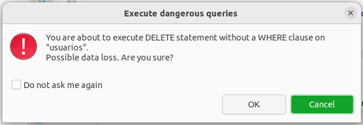
> DELETE siempre se debe especificar con WHERE que registros se van a eliminar, pues de no hacerlo se borrarían todos los registros de la tabla.

**_Ejemplo 16 :_**

> `DELETE FROM usuarios WHERE nombre = "Jazmin";`

[☝️](#contenido)

---

### Eliminar registros (TRUNCATE)

A diferencia de DELETE, TRUNCATE también elimina la cache que conserva el consecutivo de los campos AUTO_INCREMENT.

**_Ejemplo 17 :_**

Tabla antes de ejecutar TRUNCATE

Ahora ejecutamos un DELETE
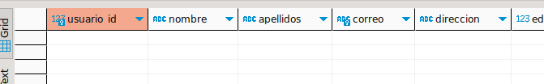

Insertamos nuevamente los datos
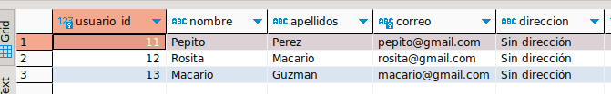
_Podemos ver que la nueva inserción ha respetado el consecutivo, ahora bien, para evitar esto se ejecuta_ TRUNCATE

> `TRUNCATE TABLE`

Así se verian los usuario_id de los registros luego de ejecutar TRUNCATE y volver a insertar los datos. Note que ahora el usuario_id empieza desde el 1.

[☝️](#contenido)

---

## OPERACIONES ARITMETICAS

    SELECT 6 + 5 AS calculo;
    SELECT 6 - 5 AS calculo;
    SELECT 6 * 5 AS calculo;
    SELECT 6 / 5 AS calculo;

[☝️](#contenido)

---

## FUNCIONES MATEMATICAS

- Modulo:

  > `SELECT MOD(10,3);`

- Aproximar número hacia arriba:

  > `SELECT CEILING(7.1);`

- Aproximar número hacia abajo:

  > `SELECT FLOOR(7.1);`

- Redondear un número:

  > `SELECT ROUND(7.5);`

- Elevar un número a una potencia:

  > `SELECT POW(2,3);`

- Raíz cuadrada:

> `SELECT SQRT (81);`

[☝️](#contenido)

---

### Columnas calculadas

**_Ejemplo 18 :_**

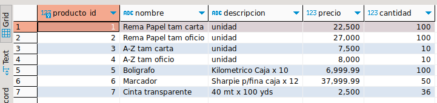

`SELECT precio * cantidad AS subtotal FROM productos WHERE producto_id = 3;`

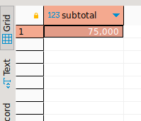

**_Ejemplo 19 :_**

> `SELECT nombre, descripcion, precio, cantidad, (precio*cantidad) AS subtotal FROM productos;`

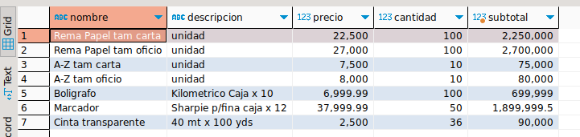

[☝️](#contenido)

---

## FUNCIONES DE AGRUPAMIENTO

    SELECT MAX(precio) FROM productos;
    SELECT MIN(precio) FROM productos;
    SELECT AVG(precio) FROM productos;
    SELECT SUM(cantidad) AS existencias FROM productos;
    SELECT COUNT(*) AS productos_total FROM productos;
    SELECT SUM(cantidad*precio) AS total FROM productos;

[☝️](#contenido)

---

## RELACIONES ENTRE TABLAS

SINTAXIS (_al momento de crear la tabla_)

    CREATE TABLE table_a (
      field_one,
      field_two,
      ...,
      ...,
      field_n,
      id_table_b,
      FOREIGN KEY (id_table_b) REFERENCES table_b(id_table_b);
    )

> [!👀]
>
> _The **table_b** must to be maked previusly_

**_Ejemplo 19 :_**

**MÉTODO CUANDO LAS TABLAS YA EXISTEN**

Teniendo en cuenta la tabla '**productos**':

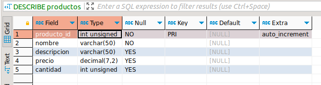

Se crea la tabla '**pedidos**' teniendo en cuenta que el campo (_producto_id_) debe tener el mismo tipo de dato que el campo 'producto_id' en la tabla pedidos '**productos**':

    CREATE TABLE pedidos (
    	pedido_id INT UNSIGNED AUTO_INCREMENT PRIMARY KEY,
    	producto_id INT UNSIGNED NOT NULL,
    	fecha DATETIME,
    	total DECIMAL(10,2)
    );

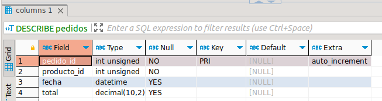

Ahora procedemos a crear la relación desde la tabla '**pedidos**' con la siguiente sintaxis:

    ALTER TABLE pedidos ADD CONSTRAINT fk_pedidos_productos FOREIGN KEY (producto_id) REFERENCES productos(producto_id);

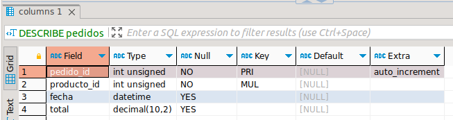

La relación ha sido creada, si nos fijamos en el campor 'producto_id' en la estructura de la tabla pedidos tiene en el KEY el Value MUL. Esto quiere decir que un mismo valor de "producto_id" puede aparecer en múltiples registros de la tabla "pedidos".

### Como modificar un CONSTRAINT

1. Eliminar el CONSTRAINT
2. Volver a añadir el FOREING KEY que contiene el nuevo CONSTRAINT

**_Eliminar el CONSTRAINT_**

`ALTER TABLE companies DROP CONSTRAINT fk_pedidos_productos;`

[☝️](#contenido)

---

### Practica clausula GROUP BY

**Objetivo :**
Saber el total de ventas por producto.

Procedemos a insertar registros en la tabla pedidos:

        INSERT INTO pedidos (producto_id,fecha,total) VALUES
        (1,"2023-02-10 10:00:00",22500),
        (1,"2023-02-15 10:00:00",22500),
        (1,"2023-02-20 10:00:00",22500),
        (1,"2023-02-28 10:00:00",22500),
        (5,"2023-03-15 10:00:00",6999.99),
        (5,"2023-03-15 10:00:00",6999.99),
        (6,"2023-04-2 10:00:00",37999.99)
        ;

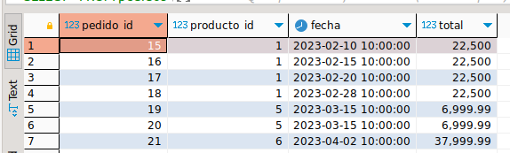

Ejecutamos la sentencia para saber el total de ventas por producto:

> `SELECT producto_id, SUM(total) AS monto_total FROM pedidos GROUP BY producto_id;`

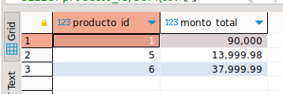

[☝️](#contenido)

### HAVING

La cláusula HAVING se utiliza en SQL para filtrar los resultados de una consulta después de aplicar una cláusula GROUP BY. A diferencia de la cláusula WHERE, que se utiliza para filtrar filas antes de agruparlas, la cláusula HAVING permite filtrar grupos de filas después de la agregación.

**_Ejemplo 20 :_**

    `SELECT producto_id, SUM(total) AS monto_total FROM pedidos GROUP BY producto_id HAVING monto_total < 30000;`

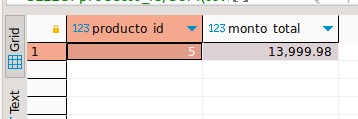

La consulta muestra el grupo de productos que tuvieron ventas inferiores a 30000. En este ejemplo el producto con id 5 tuvo ventas inferiores a un monto de 30000.

### DISTINCT

La cláusula DISTINCT se utiliza en una consulta para eliminar filar duplicadas de los resultados. Cuando se utiliza la cláusula DISTINCT en una declaración SELECT, solo se mostrará una fila para cada combinación única de valores en las columnas especificadas.

**_Ejemplo 21 :_**

Tenemos esta tabla "usuarios":

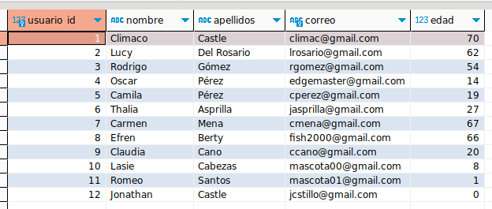

Si se ejecuta la consulta:

> `SELECT DISTINCT apellidos FROM usuarios;`

Se obtienen los siguientes resultados:

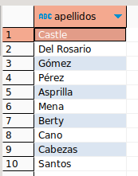

La cláusula DISTINCT eliminó las filas duplicadas basándose en los valores únicos en la columna "apellidos". Solo se muestra uan vez cada apellido, aunque haya varios usuarios con el mismo apellido en la tabla.

### ORDER

Permite ordenar con base a un campo de una tabla.

**_Ejemplo 22 :_**

Tenemos esta tabla "usuarios":

Si se ejecuta la consulta:

> `SELECT nombre FROM usuarios ORDER BY nombre;`

Se obtienen los siguientes resultados:

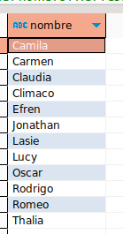

Por defecto el resultado de la consulta se muestra los datos de la columna nombres en orden ascendente (**ASC**). Si se quiere mostrar el resultado en orden descendente, añadimos (**DESC**).

**_Ejemplo 23 :_**

> `SELECT nombre FROM usuarios ORDER BY nombre DESC;`

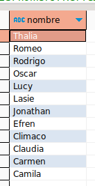

**_Ejemplo 24 :_**

**Ordenando por nombre y apellido**

> `SELECT nombre, apelldidos FROM usuarios ORDER BY nombre, apellido;`

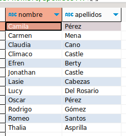

> [!👀]
>
> _Se puede usar en combinación con **WHERE** pero la cláusula **ORDER BY** debe ir al final._
>
> Ejemplo:
>
> `SELECT nombre, apellidos FROM usuarios WHERE apellidos = 'Pérez' ORDER BY nombre DESC;`
>
> 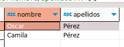

[☝️](#contenido)

### BETWEEN

Genera un resultado con base a un rango.

**_Ejemplo 24 :_**

Tenemos la siguiente tabla:

Ejecutamos la siguiente consulta:

> `SELECT * FROM pedidos WHERE total BETWEEN 5000 AND 23000;`

Tenemos el siguiente resultado:

## 

> [!👀]
>
> _También se pueden utilizar expresiones regulares en búsquedas de registros._
>
> Ejemplo:
>
> Tenemos la tabla usuarios:
>
> 
>
> Ejecutamos la siguiente consulta:
>
> `SELECT * FROM usuarios WHERE correo REGEXP '[0-9]';`
>
> 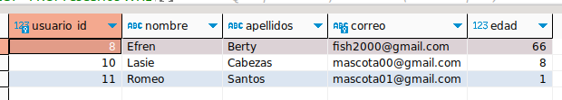
>
> Vemos como aparecen registros cuyos correos contienen números.

[☝️](#contenido)

---

## FUNCIONES DE CADENAS DE TEXTO

**_Ejemplo 25 :_**

`SELECT UPPER(nombre), UCASE(apellidos) FROM usuarios;`

ó

`SELECT UCASE(nombre), UCASE(apellidos) FROM usuarios;`

Output:

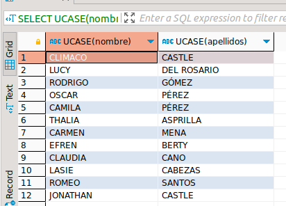

`SELECT LOWER(nombre), LOWER(apellidos) FROM usuarios;`

ó

`SELECT LCASE(nombre), LCASE(apellidos) FROM usuarios;`

### Substraer subcadenas del lado izquierdo y lado derecho

**_Ejemplo 26 :_**

`SELECT LEFT(nombre,3), RIGHT(apellidos,3) FROM usuarios;`

Output:

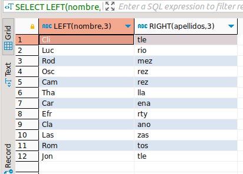

### Otras funciones :

`SELECT LENGTH(nombre) FROM usuarios;`

`SELECT REPEAT(nombre,2) FROM usuarios;`

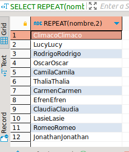

`SELECT REVERSE(nombre) FROM usuarios;`

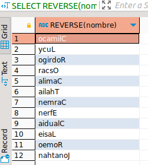

`SELECT REPLACE(nombre, 'a', '4') FROM usuarios;`

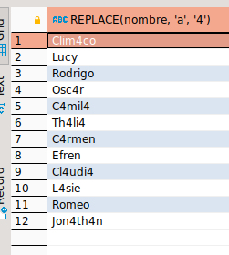

Suprimir espacios al comienzo y/o final de las palabras:

`SELECT ('    Viernes    ');`

`SELECT LTRIM('    Viernes    ');`

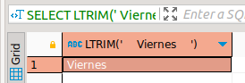

 

`SELECT ('    Viernes    ');`

`SELECT RTRIM('    Viernes    ');`

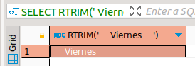

 

`SELECT ('    Viernes    ');`

`SELECT TRIM('    Viernes    ');`

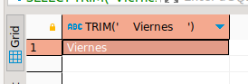

 

`SELECT CONCAT(nombre,' ',apellidos) FROM usuarios;`

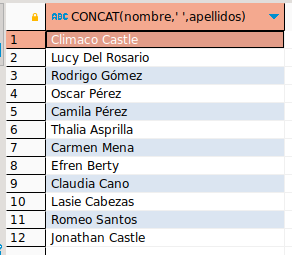

 

`SELECT CONCAT_WS(' ',nombre,apellidos,correo) FROM usuarios;`

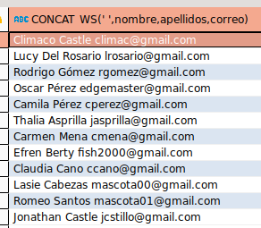

[☝️](#contenido)

---

## INDICES

Los índices en bases de datos son estructuras de datos que se crean para mejorar el rendimiento de las consultas y búsquedas en una base de datos. Un índice se construye sobre una o más columnas de una tabla y proporciona una forma rápida de acceder a los datos según los valores de esas columnas.

Cuando se crea un índice en una columna, se crea una estructura de datos adicional que contiene los valores de esa columna y los punteros a las filas correspondientes en la tabla. Esto permite que el motor de la base de datos encuentre rápidamente las filas que coinciden con los valores especificados en las consultas.

Los índices pueden mejorar significativamente el rendimiento de las consultas, especialmente cuando se realizan búsquedas en grandes conjuntos de datos. Al utilizar un índice, la base de datos puede evitar realizar una búsqueda secuencial en toda la tabla y en su lugar realizar una búsqueda más rápida y eficiente en el índice.

Sin embargo, los índices también tienen algunas implicaciones en el rendimiento y el almacenamiento de la base de datos. Cada índice ocupa espacio adicional en disco y debe mantenerse actualizado a medida que los datos cambian. Además, los índices pueden ralentizar las operaciones de inserción, actualización y eliminación de datos, ya que la base de datos debe actualizar los índices correspondientes.

Es importante diseñar cuidadosamente los índices en una base de datos, considerando las consultas más comunes que se realizarán y equilibrando el rendimiento de las consultas con el costo adicional de almacenamiento y mantenimiento de los índices.

### TABLA INDEXADA VS NO INDEXADA

Un comparativo de ejemplo realizando una busqueda por columna **Indexada** vs **NO indexada**.

**TABLA NO IDEXADA**

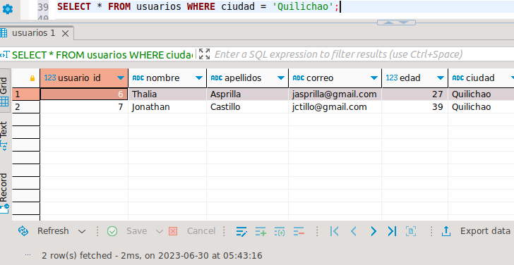

**TABLA INDEXADA**

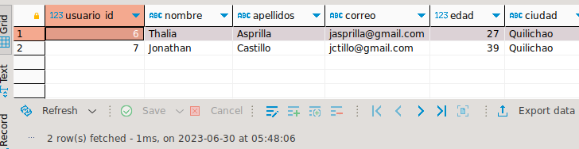

Veamos que la velocidad de la consulta fue de 1ms mientras que en la tabla no indexada fue de 2ms.

**Mostrar los indices de una tabla:**

> `SHOW INDEX FROM productos;`

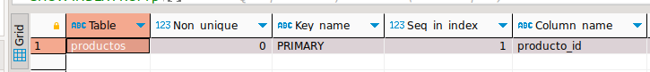

> `SHOW INDEX FROM pedidos;`

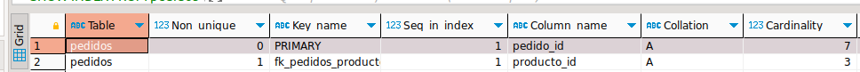

> `SHOW INDEX FROM usuarios;`

correo es un campo unique
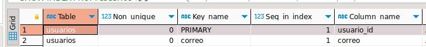

### Definir un indice

Indice que no sea ni clave primaria ni campo único.

**_Ejemplo 26 :_**

    CREATE TABLE usuarios(
    	usuario_id INT UNSIGNED AUTO_INCREMENT PRIMARY KEY,
    	nombre VARCHAR(30) NOT NULL,
    	apellidos VARCHAR(30) NOT NULL,
    	correo VARCHAR(50) UNIQUE,
    	edad INT DEFAULT 0,
    	ciudad VARCHAR(30),
    	INDEX idx_apellidos (apellidos),
    	INDEX idx_ciudad (ciudad)
    );

En este ejemplo se establecen dos indices (uno para _**apellidos**_ y otro para _**ciudad**_):

`SHOW INDEX FROM usuarios;`

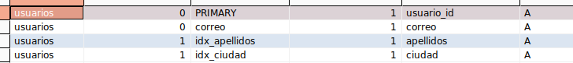

> [!👀]
>
> _Tambien se pueden agrupar los indexes de la siguiente manera:_

     CREATE TABLE usuarios(
      usuario_id INT UNSIGNED AUTO_INCREMENT PRIMARY KEY,
      nombre VARCHAR(30) NOT NULL,
      apellidos VARCHAR(30) NOT NULL,
      correo VARCHAR(50) UNIQUE,
      edad INT DEFAULT 0,
      ciudad VARCHAR(30),
      INDEX idx_usuarios (apellidos,ciudad)
    );

Vemos en la creación de la tabla que apellidos y ciudad se encuentran indezados bajo el alias 'idx_usuarios'

`SHOW INDEX FROM usuarios;`

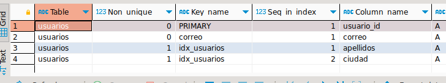

## INDICE FULL TEXT

Permite realizar la consulta más flexible a través de campos agrupados en un indice de texto completo.

Este tipo de índice permite realizar búsquedas rápidas y eficientes en el contenido textual de los documentos, en lugar de buscar solo por metadatos o información estructural.

Un índice de texto completo tiene en cuenta el contenido textual completo de cada documento, lo que incluye palabras, frases, sinónimos y otros aspectos lingüísticos.

**_Ejemplo 27 :_**

Forma de crear un FULLTEXT

    CREATE TABLE usuarios(
      usuario_id INT UNSIGNED AUTO_INCREMENT PRIMARY KEY,
      nombre VARCHAR(30) NOT NULL,
      apellidos VARCHAR(30) NOT NULL,
      correo VARCHAR(50) UNIQUE,
      edad INT DEFAULT 0,
      ciudad VARCHAR(30),
      FULLTEXT fi_usuarios (nombre,apellidos,ciudad)
    );

Luego de tener los datos insertados:

    INSERT INTO usuarios (nombre,apellidos,correo,edad,ciudad) VALUES
    ("Climaco","Castle","climac@gmail.com",70,"Buenaventura"),
    ("Lucy","Del Rosario","lrosario@gmail.com",62,"Buenaventura"),
    ("Rodrigo","Gómez","rgomez@gmail.com", 54,"Buenaventura"),
    ("Oscar","Pérez","edgemaster@gmail.com",14,"Buenaventura"),
    ("Camila","Pérez","cperez@gmail.com",19,"Buenaventura"),
    ("Thalia","Asprilla","jasprilla@gmail.com",27,"Quilichao"),
    ("Jonathan","Castillo","jctillo@gmail.com",39,"Quilichao"),
    ("Carmen","Mena","cmena@gmail.com", 67,"Buenaventura"),
    ("Efren","Berty","fish2000@gmail.com",66,"Buenaventura"),
    ("Claudia","Cano","ccano@gmail.com", 20,"Buenaventura"),
    ("Lasie","Cabezas","mascota00@gmail.com",8,"Buenaventura"),
    ("Romeo","Santos","mascota01@gmail.com",1,"Buenaventura");

Y verificar los indices de la tabla usuarios:

`SHOW INDEX FROM usuarios;`

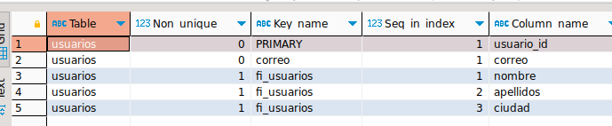

Procedemos a hacer la consultar por cualquiera de los datos contenidos en las columnas que hacen parte del indice full text. La busqueda no es sensible a mayúsculas o minúsculas.

SINTAXIS DE EJEMPLO:

`SELECT * FROM usuarios WHERE MATCH(nombre,apellidos,ciudad) AGAINST ('QUILICHAO' IN BOOLEAN MODE);`

La consulta realizó la busqueda en el conjunto de datos contenido en el capo fulltext:

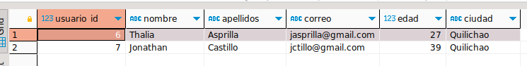

## APLICAR INDICES A UNA TABLA EXISTENTE

**_Ejemplo 28 :_**

1. Alterar la tabla para añadir la clave primaria al campo usuario_id de la tabla usuarios:

`ALTER TABLE usuarios ADD CONSTRAINT pk_usuario_id PRIMARY KEY(usuario_id);`

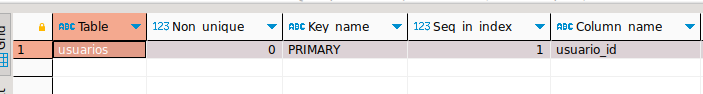

2. Asignar al campo que contiene la llave primaria el atributo autoincrement:

`ALTER TABLE usuarios MODIFY COLUMN usuario_id INT AUTO_INCREMENT;`

Listo 👌

**Bonus :**

### Añadir atributo de campo único a una columna de una tabla existente:

**_Ejemplo 29 :_**

`ALTER TABLE usuarios ADD CONSTRAINT uq_correo UNIQUE(correo);`

### Añadir un index (_común y corriente_) a una columna de una tabla existente:

`ALTER TABLE nameTable ADD INDEX i_nameField(field);`

**_Ejemplo 30 :_**

Añadiendo un index para dos campos al mismo tiempo:

`ALTER TABLE usuarios ADD INDEX i_nombre_apellido(nombre,apellidos);`

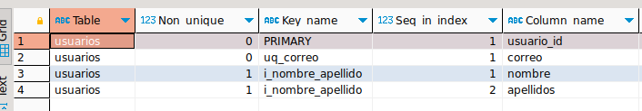

### Añadir un index FULLTEX a una tabla existente:

`ALTER TABLE nameTable ADD FULLTEXT INDEX fi_search (nameField_a, nameField_b, nameField_c);`

**_Ejemplo 31 :_**

Añadiendo un campo de texto completo incluyendo tres campos de la tabla usuarios:

`ALTER TABLE usuarios ADD FULLTEXT INDEX fi_busqueda(nombre,apellidos,ciudad);`

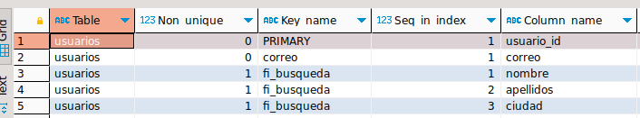

Realizando una consulta por apellido en un FULLTEXT:

`SELECT * FROM usuarios WHERE MATCH(nombre,apellidos,ciudad) AGAINST('asprilla' IN BOOLEAN MODE);`

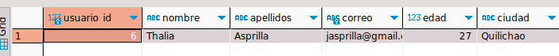

## ELIMINAR INDICES

SINTAXIS:

**_Ejemplo 32 :_**

`ALTER TABLE usuarios DROP INDEX fi_busqueda;`

Donde 'fi_busqueda' es el alias del campo indexado o el conjunto de campos indexados.

[☝️](#contenido)

---

## JOINS SQL

> La sentencia JOIN (unir, combinar) de SQL permite combinar registros de una o más tablas en una base de datos. hay tres tipo de JOIN:
>
> - Interno
> - Externo
> - Cruzado
>
> El estándar ANSI del SQL especifica cinco tipos de JOIN:
>
> 1. INNER
> 1. LEFT OUTER
> 1. RIGHT OUTER
> 1. FULL OUTER
> 1. CROSS
> 1. Una tabla puede unirse a sí misma, produciendo una auto-combinación, SELF-JOIN
>
> Matemáticamente, JOIN es composición relacional, la operación fundamental en el álgebra relacional, y, generalizando, es una función de composición.
>
> ### Combinación Interna (INNER JOIN)
>
> 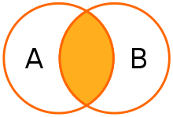
>
> Con esta operación cada registro de la tabla A es combinado con los correspondientes de la tabla B que satisfagan las condiciones que se especifiquen en el predicado JOIN. Cualquier registro de la tabla A o de la tabla B que no tenga un correpondiente en la otra tabla es excluido.
>
> Fuente [Wikedia](https://es.wikipedia.org/wiki/Sentencia_JOIN_en_SQL)

**_Ejemplo 33 :_**

INNER JOIN

Para este ejemplo tenemos la tablas:

TABLE 'legal_form'

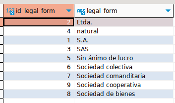

TABLE 'companies'

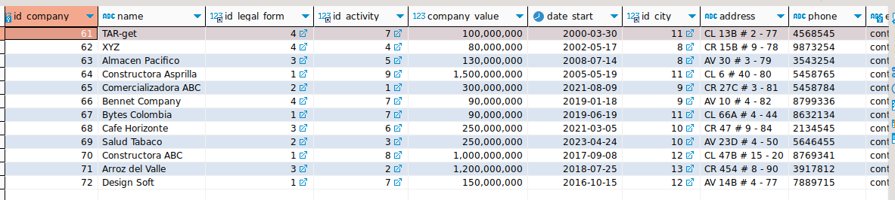

[☝️](#contenido)

Objetivo:

Traer a consulta los registros de ambas tablas que se correspondan con 'id_company' e 'id_legal_form'

SINTAXIS (explícita)

> `SELECT * FROM companies`
>
> `INNER JOIN`
>
> `legal_form ON companies.id_legal_form = legal_form.id_legal_form;`

SINTAXIS (implícita)

> `SELECT * FROM companies, legal_form`
>
> `WHERE companies.id_legal_form = legal_form.id_legal_form;`

> [!👀]
>
> Note que el campo común en ambas tablas es id_legal_form

RESULTADO

> [!👀]
>
> Las dos últimas columnas corresponden a la tabla 'legal_form'.

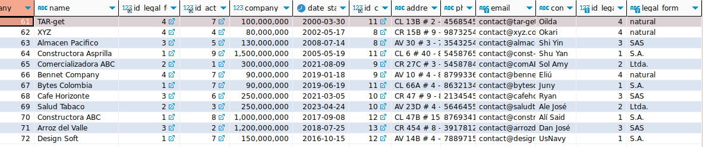

> [!👀]
>
> Note también que los otros registros de la tabla 'legal_form' no se mostraron en la consulta

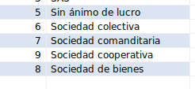

**_Ejemplo 34 :_**

CONSULTANDO CAMPOS INDIRECTAMENTE A TRAVÉS DE DOS TABLAS RELACIONADAS

En este ejemplo tenemos tres tablas:

TABLE companies:

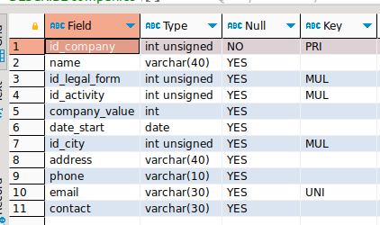

TABLE activities:

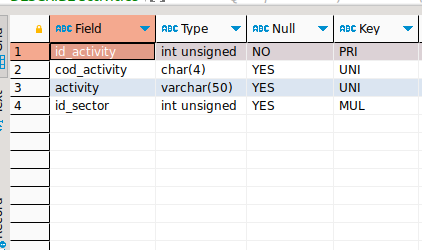

TABLE cities:

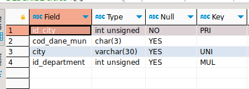

> [!👀]
>
> Hay algo interesante aquí, y es que en la siguiente consulta se pueden invocar datos de campo indirectamente relacionados. Por ejemplo si nos fijamos en la tabla 'companies' esta relacionada con la tabla 'activities' a través de la foreing key 'id_activity', sin embargo la tabla 'companies' no tiene como tal el campo 'activity', por otro lado tampoco tiene el campo 'city' pero si tiene el campo id_city.

Objetivo:

combinar las tres tablas a través y mandar a llamar los campos (_activity, city_) a través de las foreing key en la tabla companies.

SINTAXIS

    SELECT companies.name, a.activity, c.city
    FROM companies
    INNER JOIN activities a ON companies.id_activity = a.id_activity
    INNER JOIN cities c ON companies.id_city = c.id_city;

RESULTADO

Podemos ver que el INNER JOIN es una herramienta muy útil a la hora de arrastrar campos con las tablas con las cuales hay relación.

> **_Theta Join_**
>
> A la combinación que utiliza comparaciones dentro del predicado _JOIN_ se llama theta-join. Se pueden hacer comparaciones de <, <=, =, <>, >=, y >.
>
> Fuente [Wikedia](https://es.wikipedia.org/wiki/Sentencia_JOIN_en_SQL)

**_Ejemplo 35 :_**

Tenemos las tablas:

TABLE 'cities'

TABLE 'companies'

Objetivo:

Consultar las ciudades en donde hay empresas empresas con capital inferior a $130'000.000

SINTAXIS

    SELECT cities.id_city,companies.name, companies.company_value
    FROM cities JOIN companies
    ON cities.city = companies.id_city AND > companies.company_value < 130000000;

RESULTADO

Podemos observar las ciudades en donde hay empresas con un capital inferior a $130'000.000

> **_Natural Join_**
>
> Es una especialización de la combinación de igualdad, anteriormente mencionada, que se representa por el símbolo ⋈. En este caso se comparan todas las columnas que tengan el mismo nombre en ambas tablas. La tabla resultante contiene sólo una columna por cada par de columnas con el mismo nombre.
>
> Fuente [Wikedia](https://es.wikipedia.org/wiki/Sentencia_JOIN_en_SQL)

**_Ejemplo 36 :_**

Tenemos las tablas:

TABLE sectors

TABLE activities

Objetivo:

Generar una tabla que contenga el campo común, en este ejemplo el campo común es 'id_sector'

SINTAXIS

> `SELECT * FROM activities NATURAL JOIN sectors;`

RESULTADO

[☝️](#contenido)

---

> ### Combinación Externa (OUTER JOIN)
>
> Mediante esta operación no se requiere que un registro en una tabla tenga un registro relacionado en la otra tabla. El registro es mantenido en la tabla combinada aunque no exista el correspondiente en la otra tabla.
>
> Existen tres tipos de combinaciones externas, el Left Join, el Right Join y el Full Join, donde se toman todos los registros de la tabla de la izquierda, o todos los de la tabla derecha, o todos los registros respectivamente.
>
> Fuente [Wikedia](https://es.wikipedia.org/wiki/Sentencia_JOIN_en_SQL)

> LEFT JOIN
>
> El resultado de esta operación siempre contiene todos los registros de la tabla de la izquierda (la primera tabla que se menciona en la consulta), mas los elementos communes de la tabla de derecha.
>
> retorna un valor nulo **NULL** en los campos de la tabla derecha cuando no haya correspondencia.
>
> 
>
> Fuente [Wikedia](https://es.wikipedia.org/wiki/Sentencia_JOIN_en_SQL)

**_Ejemplo 37 :_**

Para este ejemplo se ha insertado un nuevo registro en la tabla sectors (LEFT) el 'id*sector = 04' (\_generado automaticamente a través de AUTO_INCREMENT*).

> `INSERT INTO sectors (cod_sector, sector) VALUES ('03','fish');`

Tenemos entonces las tablas:

TABLE LEFT 'sectors'

TABLE RIGHT 'activities'

Mientras tanto en la tabla activities no existe un registro asociado al 'id_sector = 04'

Objetivo:

Mostrar todos los registros de la tabla LEFT (sectors) que tengan o no registros relacionadados con la tabla RIGHT (activities)

SINTAXIS

`SELECT * FROM sectors LEFT JOIN activities ON sectors.id_sector = activities.id_sector;`

RESULTADO

> [!👀]
>
> Notese que como la consulta trae todos los registros de la tabla LEFT (_sectors_), muestra también el 'id*sector = 4' en **NULL** que no tiene registros en la tabla RIGHT (\_activities*)

**_LEFT JOIN excluyendo la intersección_**

> **_LEFT JOIN excluyendo la intersección_**
>
> 
>
> Si se quieren mostrar solo los registros de la primera tabla que no tengan correspondientes en la segunda, se puede agregar la condición adecuada en la cláusula WHERE.
> Fuente [Wikedia](https://es.wikipedia.org/wiki/Sentencia_JOIN_en_SQL)

**_Ejemplo 38 :_**

Del ejemplo #36 podemos cambiar el resultado para que muestre el sector que no esta asociado a ninguna actividad.

SINTAXIS

    SELECT * FROM sectors LEFT OUTER JOIN activities ON sectors.id_sector = activities.id_sector  WHERE activities.id_sector IS NULL;

RESULTADO

[☝️](#contenido)

---

### RIGHT OUTER JOIN - RIGHT JOIN

Muestra todos los registros de la tabla de la derecha, independientemente de si existe o no un registro correspondiente en la tabla de la izquierda.

> La sentencia **RIGHT OUTER JOIN** retorna todos los valores de la tabla de la derecha con los valores de la tabla de la izquierda correspondientes, si los hay, o retorna un valor nulo **NULL** en los campos de la tabla izquierda cuando no haya correspondencia.

**_Ejemplo 39 :_**

Tenemos las tablas:

TABLE LEFT sectors

TABLE RIGHT activities

Objetivo:

Retornar todos los valores de la tabla de la derecha (_activities_) con los valores de la tabla de la izquierda correspondientes, si los hay, o retornar un valor nulo **NULL** en los campos de la tabla izquierda (_sectors_) cuando no haya correspondencia.

SINTAXIS

    SELECT * FROM activities RIGHT OUTER JOIN sectors ON activities.id_sector = sectors.id_sector;

RESULTADO

**_RIGHT JOIN excluyendo la intersección_**

Permite mostrar solo los registros de la tabla LEFT (_sectors_) que no tengan correspondientes en la tabla RIGHT (activities). Se puede agregar la condición adecuada en la cláusula WHERE.

SINTAXIS

    SELECT
    *
    FROM activities
    RIGHT OUTER JOIN sectors ON activities.id_sector = sectors.id_sector WHERE activities.id_sector IS NULL;

RESULTADO

**_Combinación completa (FULL OUTER JOIN)_**

Esta operación presenta los resultados de la tabla de la izquierda y tabla de la derecha aunque alguna no tegan correspondencia en la otra tabla.

**_Ejemplo 40 :_**

Tenemos las tablas:

TABLE LEFT (_sectors_)

TABLE RIGHT (_activities_)

Objetivo:

Mostrar los registros de ambas tablas relacionadas al campo común 'id_sector' tengan o no correspondencia los registros.

SINTAXIS

`SELECT * FROM sectors FULL OUTER JOIN activities ON sectors.id_sector = activities.id_sector`;

> [!👀]
>
> En MySQL, no hay una cláusula FULL OUTER JOIN directamente. Sin embargo, puedes simularlo combinando un LEFT JOIN y un RIGHT JOIN.

    SELECT *
    FROM sectors
    LEFT JOIN activities ON sectors.id_sector = activities.id_sector
    UNION
    SELECT * FROM sectors
    RIGHT JOIN activities ON sectors.id_sector = activities.id_sector
    WHERE sectors.id_sector IS NULL;

En este ejemplo, **sectors** y **activities** son las tablas que deseas combinar en un **FULL OUTER JOIN**. La condición de combinación (sectors.id_sector = activities.id_sector) puede ser reemplazada por la condición adecuada para tu caso.

El primer SELECT utiliza un LEFT JOIN para combinar las filas de la tabla **sectors** con las filas correspondientes de tabla **activities**. El UNION se utiliza para combinar los resultados del primer SELECT con el segundo SELECT.

El segundo SELECT utiliza un RIGHT JOIN para combinar las filas de tabla **activities** con las filas correspondientes de tabla **sectors**. La cláusula **WHERE sectors.id_sector IS NULL** se utiliza para seleccionar solo las filas que no coinciden con la tabla **sectors**.

El resultado final será un conjunto de resultados que simula un FULL OUTER JOIN entre la tabla **sectors** y **activities**.

RESULTADO

**_FULL JOIN excluyendo la intersección_**

Se muestran solo los registros de la tabla que no tenan correspondencia en la otra.

SINTAXIS

_SIMULACIÓN DE UN FULL JOIN excluyendo la intersección EN MySQL_

    SELECT
    *
    FROM sectors
    LEFT JOIN activities ON sectors.id_sector = activities.id_sector
    WHERE activities.id_sector IS NULL
    UNION
    SELECT * FROM sectors
    RIGHT JOIN activities ON sectors.id_sector = activities.id_sector
    WHERE sectors.id_sector IS NULL;

RESULTADO

[☝️](#contenido)

---

## VISTA

Es una tabla virtual que se deriva de una o varias tablas existenten en la base de datos.

Las vistas se utilizan para simplificar las consultas complejas, ocultar los detalles de implementación y proporcionar una capa adicional de seguridad.

Para crear una vista en SQL, se utiliza la instrucción CREATE VIEW seguida del nombre de la vista y la definición de la consulta.

**_Ejemplo 41 :_**

SINTAXIS

    CREATE VIEW ejemplo_vista AS SELECT companies.name, a.activity, c.city

    FROM companies

    INNER JOIN activities a ON companies.id_activity = a.id_activity

    INNER JOIN cities c ON companies.id_city = c.id_city;

RESULTADO

Una vez creada la vista, se puede utilizar como si fuera una tabla normal en consultas SELECT, INSERT, UPDATE o DELETE. Aquí hay un ejemplo de cómo utilizar la vista creada anteriormente:

`SELECT * FROM ejemplo_vista;`

Es importante tener en cuenta que una vista no contiene datos físicos en sí misma, sino que almacena la consulta que define la vista. Cada vez que se hace referencia a la vista, se ejecuta la consulta y se devuelve el resultado actualizado.

Además, las vistas pueden tener restricciones y se pueden actualizar siempre que cumplan ciertos criterios. Sin embargo, las vistas no son adecuadas para todas las situaciones, ya que pueden tener un impacto en el rendimiento si se utilizan en consultas complejas o con grandes volúmenes de datos.

ELIMINAR UNA VISTA

`DROP VIEW ejemplo_vista`

MOSTRAR LAS VISTAS

`SHOW FULL TABLES IN business_directory WHERE TABLE_TYPE LIKE 'VIEW';`

[☝️](#contenido)

---

## MOTORES DE BASES DE DATOS

### Especificar el ENGINE de las tablas

El ENGINE se pone cuando la versión del motor de base de datos en MySQL es menor o igual a 5.5. MyISAM era motor de almacenamiento prodeterminado.

    CREATE TABLE departments (
      id_department INT UNSIGNED AUTO_INCREMENT PRIMARY KEY,
      cod_dane_dep CHAR(2) UNIQUE,
      department VARCHAR(30) UNIQUE
    ) ENGINE=MyISAM;

`DROP TABLE departments;`

    CREATE TABLE departments (
      id_department INT UNSIGNED AUTO_INCREMENT PRIMARY KEY,
      cod_dane_dep CHAR(2) UNIQUE,
      department VARCHAR(30) UNIQUE
    ) ENGINE=InnoDB;

**Diferencias :**

Transacciones: InnoDB es un motor de almacenamiento transaccional que admite el concepto de transacciones, lo que permite combinar múltiples operaciones en una unidad atómica. Esto garantiza la consistencia de los datos y permite la recuperación en caso de fallos. Por otro lado, MyISAM no es transaccional y no soporta transacciones.

Bloqueo de nivel de fila: InnoDB utiliza un mecanismo de bloqueo de nivel de fila para gestionar el acceso concurrente a los datos. Esto permite que varias transacciones accedan a diferentes filas de una tabla simultáneamente sin bloquear toda la tabla. En cambio, MyISAM utiliza un mecanismo de bloqueo de nivel de tabla, lo que significa que cuando una transacción realiza una operación en una tabla, bloquea toda la tabla, lo que puede causar bloqueos y afectar el rendimiento en entornos de alta concurrencia.

Integridad referencial: InnoDB admite las restricciones de integridad referencial, como las claves foráneas, que garantizan que los datos relacionados entre tablas se mantengan consistentes. MyISAM no admite restricciones de integridad referencial y no garantiza la consistencia de los datos relacionados automáticamente.

Recuperación ante fallos: InnoDB es capaz de recuperarse de manera más confiable ante fallos debido a su soporte de transacciones y su registro de transacciones. Puede realizar una recuperación automática en caso de un fallo del sistema o un corte de energía. Por otro lado, MyISAM no tiene un registro de transacciones y la recuperación puede ser más difícil y propensa a errores en caso de fallos.

Rendimiento en consultas de lectura y escritura: En general, InnoDB tiende a ser más rápido en consultas que involucran escritura y lectura simultáneas debido a su gestión de bloqueo de nivel de fila y optimizaciones internas. MyISAM puede tener un mejor rendimiento en consultas de solo lectura, especialmente cuando se trata de tablas estáticas sin actualizaciones frecuentes.

[☝️](#contenido)

---

## JUEGO DE CARÁCTERES EN LA BASE DE DATOS

Unicode (UCA 9.0.0) independientes de acentos, independiente de minúsculas, independiente de mayúsculas.

### Establer el juego de carácteres en la base de datos

    CREATE TABLE departments (
      id_department INT UNSIGNED AUTO_INCREMENT PRIMARY KEY,
      cod_dane_dep CHAR(2) UNIQUE,
      department VARCHAR(30) UNIQUE
    ) ENGINE=MyISAM DEFAULT CHARSET=utf8mb4;

`DROP TABLE departments;`

    CREATE TABLE departments (
      id_department INT UNSIGNED AUTO_INCREMENT PRIMARY KEY,
      cod_dane_dep CHAR(2) UNIQUE,
      department VARCHAR(30) UNIQUE
    ) ENGINE=InnoDB DEFAULT CHARSET=utf8mb4;

[☝️](#contenido)

---

## RESTRICCIONES

- CASCADE

  Cuando se establece la restricción CASCADE en una relación de clave externa, cualquier actualización o eliminación realizada en la tabla principal (tabla referenciada) se propagará automáticamente a las tablas secundarias (tablas que contienen la clave externa). Por ejemplo, si se elimina una fila de la tabla principal, todas las filas correspondientes en las tablas secundarias también se eliminarán automáticamente.

- SET NULL

  Al establecer la restricción SET NULL, si se actualiza o elimina una fila en la tabla principal, los valores de la clave externa en las tablas secundarias se establecerán en NULL. Esto implica que las filas en las tablas secundarias quedarán "huérfanas" sin una referencia válida a la tabla principal.

- SET DEFAULT

  Esta restricción permite establecer un valor predeterminado en las claves externas de las tablas secundarias cuando se actualiza o elimina una fila en la tabla principal. De esta manera, en lugar de establecer el valor en NULL, se establecerá en un valor predeterminado definido anteriormente.

- RESTRICT

  Con esta restricción, se impide cualquier operación de actualización o eliminación en la tabla principal si existen registros relacionados en las tablas secundarias. En otras palabras, RESTRICT actúa como una restricción de integridad referencial y evita acciones que puedan dejar inconsistencias en los datos.

### CASOS PRACTICOS

---

CASO 1 (_RESTRICT_)

**Tenemos las tablas**

TABLE companies (_Tabla principal_)

TABLE activities (_Tabla secundaria_)

Intentare eliminar la actividad con id = 9

El mensaje avisa que no se puede eliminar o actualizar la fila debido a que ese registro (id_activity = 9) hace parte de un campo que es llave foranea en la tabla companies. **La tabla principal companies es dependiente de ese registro.**

Ahora voy a intentar eliminar la actividad con id = 11 en la tabla activities.

**_Sucede lo mismo al intentar hacer un UPDATE de un registro que hace parte de una llave foránea en la tabla principal_**

Notemos que este registro si se dejo eliminar ya que en la tabla companies no había un registro con un id_activity = 11. **La tabla principal companies no era dependiente de ese registro.**

---

- CASO 2 (_CASCADE_)

Actualizar los registros en la tabla principal desde la tabla secundaria.

> [!👀]
>
> Ten cuidado al eliminar tus tablas, esto solo se esta haciendo para fines de mostrar un ejemplo.

 

Eliminando la tabla principal

 

Eliminando la tabla secundaria

 

Creamos de nuevo la tabla secundaria

    CREATE TABLE activities (
      id_activity INT UNSIGNED AUTO_INCREMENT PRIMARY KEY,
      cod_activity CHAR(4) UNIQUE,
      activity VARCHAR(50) UNIQUE
    );

 

Insertamos registros en la tabla secundaria

    INSERT INTO activities (cod_activity, activity) VALUES
      ('471','retail trade in non-specialized stores'),
      ('0112','rice cultivation'),
      ('0114','tabaco cultivation'),
      ('411','building construction'),
      ('4775','retail trade of second-hand items'),
      ('0123','coffe growing'),
      ('478','retail trade in mobile sales points'),
      ('4111','construction of residencials buildings'),
      ('4112','construction of non-residential buildings');

 

Creamos la tabla principal añadiendo un RESTRICT para DELETE y un UPDATE en CASCADE para los registros pertenecientes a la llave foránea.

    CREATE TABLE companies (
      id_company INT UNSIGNED AUTO_INCREMENT PRIMARY KEY,
      name VARCHAR(40) UNIQUE,
      id_activity INT UNSIGNED,
      FOREIGN KEY (id_activity) REFERENCES activities(id_activity)
      ON DELETE RESTRICT ON UPDATE CASCADE
    );

 

Insertamos registros en la tabla primaria

    INSERT INTO companies (name,id_activity) VALUES
      ('TAR-get',4),
      ('XYZ',4),
      ('Almacen Pacifico',3),
      ('Constructora Asprilla',1),
      ('Comercializadora ABC',2),
      ('Bennet Company',4),
      ('Bytes Colombia',1),
      ('Cafe Horizonte',3),
      ('Salud Tabaco',2),
      ('Constructora ABC',1),
      ('Arroz del Valle',3),
      ('Design Soft',1);

 

Intentando eliminar un registro en la tabla secundaria para comprobar la restricción DELETE

Ahora intentemos hacer un UPDATE desde la tabla secundaria para comprobar la CASCADA

La actualización fue aplicada correctamente en todos los registros con la condición id_activity = 4 en la tabla principal. Ahora es id_activity = 15

La tabla secundaria también cambio desplazando el id_activity = 4 como id_activity = 15

🫶 _Ahora le encontramos sentido a la integridad referencial._

- CASO 3 (_SET NULL_)

Poner por defecto el valor NULL en el registro de llave foránea cuando se elimina de la tabla secundaria 'activities'.

> [!👀]
>
> Ten cuidado al eliminar tus tablas, esto solo se esta haciendo para fines de mostrar un ejemplo.

 

Eliminando la tabla principal

 

Eliminando la tabla secundaria

 

Creamos de nuevo la tabla secundaria

    CREATE TABLE activities (
      id_activity INT UNSIGNED AUTO_INCREMENT PRIMARY KEY,
      cod_activity CHAR(4) UNIQUE,
      activity VARCHAR(50) UNIQUE
    );

 

Insertamos registros en la tabla secundaria

    INSERT INTO activities (cod_activity, activity) VALUES
      ('471','retail trade in non-specialized stores'),
      ('0112','rice cultivation'),
      ('0114','tabaco cultivation'),
      ('411','building construction'),
      ('4775','retail trade of second-hand items'),
      ('0123','coffe growing'),
      ('478','retail trade in mobile sales points'),
      ('4111','construction of residencials buildings'),
      ('4112','construction of non-residential buildings');

 

Creamos la tabla principal 'companies' añadiendo **SET NULL para DELETE** y un UPDATE en CASCADE para los registros pertenecientes a la llave foránea.

    CREATE TABLE companies (
      id_company INT UNSIGNED AUTO_INCREMENT PRIMARY KEY,
      name VARCHAR(40) UNIQUE,
      id_activity INT UNSIGNED,
      FOREIGN KEY (id_activity) REFERENCES activities(id_activity)
      ON DELETE SET NULL ON UPDATE CASCADE
    );

 

Insertamos registros en la tabla primaria

    INSERT INTO companies (name,id_activity) VALUES
      ('TAR-get',4),
      ('XYZ',4),
      ('Almacen Pacifico',3),
      ('Constructora Asprilla',1),
      ('Comercializadora ABC',2),
      ('Bennet Company',4),
      ('Bytes Colombia',1),
      ('Cafe Horizonte',3),
      ('Salud Tabaco',2),
      ('Constructora ABC',1),
      ('Arroz del Valle',3),
      ('Design Soft',1);

 

Ahora veamos los registros combinando ambas tablas:

    SELECT id_company, name, a.cod_activity, a.activity
      FROM companies
      INNER JOIN activities a
      ON companies.id_activity = a.id_activity;

 

COMPROBANDO SET NULL

Para este caso, vamos a eliminar la id_activity = 3 que corresponde 'tabaco cultivation'

Vamos a ver como queda el SELECT anterior eliminando el id_activity = 3

`DELETE FROM activities WHERE id_activity = 3;`

Al ser el INNER JOIN una intercepción entre las dos tablas, los registros eliminados de la tabla 'activities' ya no aparecen en la consulta.

Sin embargo si hacemos un SELECT solo de la tabla 'companies' vemos que los registros eliminados de la tabla 'activities' y que aparecian en 'companies' ahora son NULL.

[☝️](#contenido)

---

## TRANSACCIONES

se refiere a una secuencia de operaciones o acciones que se ejecutan como una unidad atómica e indivisible. Estas operaciones pueden incluir inserciones, actualizaciones, eliminaciones u otras acciones que modifican los datos almacenados en la base de datos.

Una transacción debe cumplir con las siguientes propiedades, conocidas como las propiedades ACID:

### Atomicidad (Atomicity):

La atomicidad asegura que una transacción se considere como una operación única e indivisible. Esto significa que todas las acciones dentro de la transacción se ejecutan en su totalidad o ninguna de ellas. Si una parte de la transacción falla, se deshacen todas las acciones previas (rollback) para mantener la consistencia de los datos.

### Consistencia (Consistency):

La consistencia garantiza que una transacción lleve la base de datos desde un estado válido a otro estado válido. Las reglas y restricciones de integridad de la base de datos deben cumplirse antes y después de la transacción.

### Aislamiento (Isolation):

El aislamiento asegura que cada transacción se ejecute en un ambiente aislado de otras transacciones concurrentes. Esto evita que los cambios realizados por una transacción interfieran o afecten a otras transacciones que están ocurriendo al mismo tiempo.

### Durabilidad (Durability):

La durabilidad garantiza que una vez que una transacción se ha completado correctamente y se ha confirmado, los cambios realizados en la base de datos persistirán incluso en caso de fallos del sistema, como cortes de energía o reinicios.

**_Ejemplo 42 :_**

MOMENTOS DE LA TRANSACCION

---

Inicio de la transacción  
`START TRANSACTION;`

 

Actualizando un registro  
`UPDATE activities SET cod_activity = '0122' WHERE cod_activity = '0112';`

 

Eliminando todos los registros de la tabla  
`DELETE FROM activities;`

 

Insertando un nuevo registro a la tabla  
`INSERT INTO activities VALUES (10,'0615', 'support technology');`

 

> [!👀]
>
> El ROLLBACK
>
> _Si ejecutamos la linea de ROLLBACK el estado de las tablas vuelve justo antes de iniciar la transacción._

Ejecutando el ROLLBACK  
`ROLLBACK;`  

 

Verificando que la tabla 'activities' haya regresado antes de la transacción.  
`SELECT * FROM activities;`  

 

Si no hubiesemos reversado la transacción con el ROLLBACK, para concluir la transacción, es decir guardar los cambios de las sentencias, se ejecuta la siguinte linea:  
`COMMIT;`

[☝️](#contenido)

---

## LIMIT

Permite mostrar los registros en bloques.

**_Ejemplo 43 :_**

Vamos a utilizar nuevamente la tabla 'activities'

Verifiquemos primero algo... En la parte inferior derecha aparece que pueden mostrarse hasta un bloque total de 200 registros.

En este ejemplo vamos a limitar la paginación a bloques de 3 registros

SINTAXIS

`SELECT * FROM activities LIMIT 3;`

RESULTADO

Hay otra manera de seccionar los bloques y es eligiendo el punto de partida de donde se quieren empezar a mostrar los bloques de registros. Por ejemplo vamos a mostrar registro a partir del la cuarta fila hasta la 6 fila.

Esta seria la sintaxis:

`SELECT * FROM activities LIMIT 3,3;`

[☝️](#contenido)

---

## FUNCIONES DE ENCRIPTACION

**Buenas prácticas** ✔️

Casos de uso: encriptación de password o claves.

### Función MD5

Convierte una cadena de texto a un valor de tipo hash de 128 bits.

SINTAXIS

`SELECT MD5('m1 pA$$w0rd');`

### Función SHA1

Tambien va a generar un valor de hash de hasta 160 bits.

SINTAXIS

`SELECT SHA1('m1 pA$$w0rd');`

### Función SHA2

Permite indicar el número de bits que va a formar el sha.

SINTAXIS

`SELECT SHA2('m1 pA$$w0rd', 256);`

### Función AES_ENCRYPT

Funciona como un factor de doble autenticación.
Utiliza una llave secreta.

`SELECT AES_ENCRYPT('m1 pA$$w0rd', 'llave_secreta');`

**D E S E N C R I P T A R**

Se reciben dos parámetros:

1. El campo donde se va a desencriptar
1. la llave secreta

SINTAXIS

`SELECT AES_DECRYPT(nombre_campo, 'llave_secreta');`

**_Ejemplo 44 :_**

Para datos encriptados se recomienda utilizar el tipo de datos BLOB

Tenemos la siguiente encriptación:

    CREATE TABLE cuentas_de_email(
      email VARCHAR(30) PRIMARY KEY,
      name VARCHAR(30) NOT NULL,
      pwd BLOB
    );

    INSERT INTO cuentas_de_email VALUES
      ('jcastillo@tar-get.co','Jonathan', AES_ENCRYPT('pAssword1', 'pina')),
      ('climactano@tar-get.co','Climaco', AES_ENCRYPT('pAssword1', 'mango')),
      ('lgrajales@tar-get.co','Lucy', AES_ENCRYPT('pAssword1', 'ciruela')),
      ('operez@tar-get.co','Oscar', AES_ENCRYPT('pAssword1', 'granadina')),
      ('bgomez@tar-get.co','Blanca', AES_ENCRYPT('pAssword1', 'banano'));

    SELECT * FROM cuentas_de_email;

### Casting

Hacemos un casteo, pasamos el tipo de dato de BLOB a CHART.

SINTAXIS

`SELECT CAST(AES_DECRYPT(pwd, 'ciruela') AS CHAR) AS tdc, name FROM cuentas_de_email;`

_Observamos que se ha desencriptado el registro con la llave secreta 'ciruela'_

1. En el casteo la funcion AES_DECRYP toma dos parámetros, el primero es el nombre del campo, el segundo la llave secreta.
1. Dentro del casting se especifica el tipo de dato al que se va a convertir el dato encriptado.
1. Se especifica el alias del campo.

[☝️](#contenido)

---

## PROCEDIMIENTOS ALMACENADOS

Un procedimiento almacenado es una colección de comandos SQL que se guarda en una base de datos y se ejecuta mediante una única llamada a la base de datos. Estos procedimientos son utilizados para encapsular y ejecutar tareas específicas dentro de la base de datos, lo que ofrece ventajas en términos de seguridad, rendimiento y mantenimiento.

Beneficios de los procedimientos almacenados:

- Rendimiento: Almacenar el código en el servidor de la base de datos reduce la cantidad de datos enviados a través de la red, mejorando el rendimiento en aplicaciones remotas.

- Seguridad: Los procedimientos almacenados pueden tener permisos de acceso asignados, lo que controla quién puede ejecutarlos y qué operaciones pueden realizar.

- Mantenimiento: Al tener el código SQL encapsulado en un procedimiento, los cambios en la lógica de negocio pueden realizarse dentro del procedimiento sin modificar la aplicación que lo invoca.

Los procedimientos almacenados son una herramienta poderosa para interactuar con una base de datos y ofrecen ventajas en términos de seguridad, rendimiento y mantenimiento. Sin embargo, su implementación debe realizarse con cuidado, asegurándose de que cumplan con los estándares y prácticas recomendadas para mantener una base de datos eficiente y segura.

**_Ejemplo 45 :_**

Tomado del curso 'Curso SQL - jonmircha' en YouTube
https://youtu.be/UAuZvxPTi58?t=25530

SINTAXIS PARA CREACIÓN DE STORE PROCEDURE

> [!👀]
>
> Se sugiere ejecutar la creación del store procedure en una nuevo archivo de script para correr la ejecución de todo el bloque

    DELIMITER //

    CREATE PROCEDURE sp_obtener_suscripciones()

      BEGIN
        SELECT * FROM suscripciones;
      END //

    DELIMITER ;

INVOCAR AL STORE PROCEDURE

`CALL sp_obtener_suscripciones(); `

LISTAR STORE PROCEDURES

`SHOW PROCEDURE STATUS WHERE db = 'curso_sql';`

ELIMINAR UN STORE PROCEDURE

`DROP PROCEDURE sp_obtener_suscripciones;`

## Suscripción a servicio

## **Lógica hipotetica de negocios - ejemplo 45:**

Validar que el correo no existe

- Si no existe hago un INSERT en la tabla de clientes con los datos del cliente.
- Hago un INSERT a la tabla de tarjetas con la tarjeta del cliente.
- Hago un INSERT a la tabla de servicios, con la información del cliente, la tarjeta y la suscripción que el usuario haya elegido.

Tabla suscripciones

    CREATE TABLE suscripciones (
      suscripcion_id INT UNSIGNED AUTO_INCREMENT PRIMARY KEY,
      suscripcion VARCHAR(30) NOT NULL,
      costo DECIMAL(5,2) NOT NULL
    );

    INSERT INTO suscripciones VALUES
      (0,'Bronce', 199.99),
      (0,'Plata', 299.99),
      (0, 'Oro', 399.99);

Tabla tarjetas

    CREATE TABLE tarjetas (
      tarjeta_id INT UNSIGNED AUTO_INCREMENT PRIMARY KEY,
      cliente INT UNSIGNED,
      tarjeta BLOB,
      FOREIGN KEY(cliente)
        REFERENCES clientes(cliente_id)
        ON DELETE RESTRICT
        ON UPDATE CASCADE
    );

Tabla servicios

    CREATE TABLE servicios (
      servicio_id INT UNSIGNED AUTO_INCREMENT PRIMARY KEY,
      cliente INT UNSIGNED,
      tarjeta INT UNSIGNED,
      suscripcion INT UNSIGNED,
      FOREIGN KEY(cliente)
        REFERENCES clientes(cliente_id)
        ON DELETE RESTRICT
        ON UPDATE CASCADE,
      FOREIGN KEY(tarjeta)
        REFERENCES tarjetas(tarjeta_id)
        ON DELETE RESTRICT
        ON UPDATE CASCADE,
      FOREIGN KEY(suscripcion)
        REFERENCES suscripciones(suscripcion_id)
        ON DELETE RESTRICT
        ON UPDATE CASCADE
    );
    DELIMITER //

## STORE PROCEDURE PARA LA LOGICA DE NEGOCIOS

    ## PARAMETROS DE ENTRADA Y SALIDA DEL STORE PROCEDURE
    CREATE PROCEDURE sp_asignar_servicio(
      ## Las carácteristicas de las variables deben coicidir con los de tabla
      IN i_suscripcion INT UNSIGNED,
      IN i_nombre VARCHAR(30),
      IN i_correo VARCHAR(50),
      IN i_tarjeta VARCHAR(16),
      OUT o_respuesta VARCHAR(50)
    )
      ## LOGICA DE NEGOCIO
      BEGIN
        ## DECLARACION DE VARIABLES

        DECLARE existe_correo INT DEFAULT 0;
        DECLARE cliente_id INT DEFAULT 0;
        DECLARE tarjeta_id INT DEFAULT 0;

        START TRANSACTION;

          SELECT COUNT(*) INTO existe_correo
            FROM clientes
            WHERE correo = i_correo;

          IF existe_correo <> 0 THEN
            SELECT 'Tu correo ya ha sido registrado' INTO  o_respuesta;
          ELSE
            INSERT INTO clientes VALUES (0, i_nombre, i_correo);
            SELECT LAST_INSERT_ID() INTO cliente_id;

            INSERT INTO tarjetas
              VALUES (0, cliente_id, AES_ENCRYPT(i_tarjeta, cliente_id));
            SELECT LAST_INSERT_ID() INTO tarjeta_id;

            INSERT INTO servicios
              VALUES (0, cliente_id, tarjeta_id, i_suscripcion);

            SELECT 'Servicio almacenado con éxito' INTO o_respuesta;
          END IF;
        COMMIT;
      END //

    DELIMITER ;

`SHOW PROCEDURE STATUS WHERE db = 'curso_sql';`

EJECUTANDO EL STORE PROCEDURE

    SELECT * FROM suscripciones s;
    SELECT * FROM clientes;
    SELECT * FROM tarjetas;
    SELECT * FROM servicios;

    ## Verificamos los parámetros del Store Procedure
    ## @rest es la variable de respuesta del sp
    CALL sp_asignar_servicio(3,'jonvzcas','vzcastillo@aol.com','0123456789012345', @res);

`SELECT @res;`

`SELECT * FROM clientes;`

`SELECT * FROM tarjetas;`

`SELECT * FROM servicios;`

SI VOLVEMOS A EJECUTAR EL STORE PROCEDURE

`SELECT @res;`

Indica que el correo ya fue registrado

[☝️](#contenido)

---

## DISPARADORES (TRIGGERS)

Ejecuta de forma automatica una acción en respuesta a eventos en la base de datos. Alguna operación que afecte datos (UPDATE, INSERT, DELETE).

SINTAXIS

    DELIMITER //

    CREATE TRIGGER nombre_disparador
      [BEFORE | AFTER]
      [INSERT | UPDATE | DELETE]
      ON nombre_tabla
      FOR EACH ROW
    BEGIN
    END //

    DELIMITER ;

**_Ejemplo 46 :_**

Siguiendo con la lógica de negocios del ejemplo 45 vamos a crear una tabla que haga las veces de log y que inserte un registro automáticamente cuando se ejecute un evento.

    CREATE TABLE actividad_clientes(
      ac_id INT UNSIGNED AUTO_INCREMENT PRIMARY KEY,
      cliente INT UNSIGNED,
      fecha DATETIME,
      FOREIGN KEY (cliente)
        REFERENCES clientes(cliente_id)
        ON DELETE RESTRICT
        ON UPDATE CASCADE
    );

La tabla por ahora se encuentra vacia

CREANDO EL TRIGGER

    DELIMITER //

    CREATE TRIGGER tg_actividad_clientes
      AFTER INSERT
      ON clientes
      FOR EACH ROW
    BEGIN
      ## De esta forma se estaria almacenando el disparador
      INSERT INTO actividad_clientes VALUES (0, NEW.cliente_id, NOW());
    END //

    DELIMITER ;

    /*
    * De donde se obtiene el id del cliente?
    * A través del objeto NEW obtiene el valor que se inserto y que origino la ejecución del disparador
    * NOW permite obtener la fecha y la hora actual
    * */

EJECUTANDO EL TRIGGER

1. Ejecutamos el store procedure para activar el trigger

`CALL sp_asignar_servicio(3,'climaco','climactano@yahoo.com','0123456789012356', @res);`
`SELECT @res;`

2. Verificando el contenido de las tablas

Tabla clientes

Tabla tarjetas

Tabla servicios

VER LOS TRIGGERS EN UNA BASE DE DATOS

`SHOW TRIGGERS FROM curso_sql;`

3. Verificamos que se haya ejecutado el trigger en la tabla actividad_clientes

_El registro se insertó automáticamente al ejecutarse un evento de inserción en la tabla clientes. _

ELIMINAR UN TRIGGER

`DROP TRIGGER tg_actividad_clientes;`

[☝️](#contenido)

---
