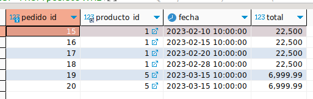
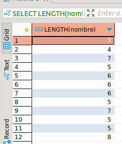

# APUNTES DEL ESTÁNDAR SQL

# Contenido

1. [TIPOS DE SENTENCIAS EN SQL](#tipos-de-sentencias-en-sql)
1. [COMENTARIOS](#comentarios)
1. [CREAR USUARIO](#crear-usuario)
   - [Iniciar sesión con el usuario](#iniciar-sesión-con-el-usuario)
   - [Asignar privilegios a un usuario](#asignar-privilegios-a-un-usuario)
   - [Mostrar privilegios de un usuario](#mostrar-privilegios-de-un-usuario)
   - [Revocar todos los permisos a un usuario](#revocar-todos-los-permisos-a-un-usuario)
   - [Eliminar un usuario](#eliminar-un-usuario)
1. [CREAR TABLAS](#crear-tablas)
   - [Mostrar las tablas existentes](#mostrar-las-tablas-existentes)
   - [COUNT](#count)
   - [IN](#in)
   - [Describir las características de una tabla](#describir-las-características-de-una-tabla)
   - [Modificar (ALTER) una tabla](#modificar-alter-una-tabla)
1. [ELIMINAR (DROP) UNA TABLA](#eliminar-drop-una-tabla)
1. [OPERACIONES CRUD](#operaciones-crud)
   - [Insertar (INSERT)](#insertar-insert)
   - [Mostrar registros (SELECT)](#mostrar-registros-select)
   - [Comodin (LIKE) - Búsquedas de Patrones](#comodin-like---búsquedas-de-patrones)
   - [Operadores Relacionales](#operadores-relacionales)
1. [OPERACIONES ARITMETICAS](#operaciones-aritmeticas)
1. [FUNCIONES MATEMATICAS](#funciones-matematicas)
   - [Colummnas calculadas](#columnas-calculadas)
1. [FUNCIONES DE AGRUPAMIENTO](#funciones-de-agrupamiento)
1. [RELACIONES ENTRE TABLAS](#relaciones-entre-tablas)
1. [Practica clausula GROUP BY](#practica-clausula-group-by)
   - [HAVING](#having)
   - [DISTINCT](#distinct)
   - [ORDER](#order)
1. [INDICES](#indices)
   - [TABLA INDEXADA VS NO INDEXADA](#tabla-indexada-vs-no-indexada)
   - [Definir un indice](#definir-un-indice)
1. [INDICE FULL TEXT](#indice-full-text)
1. [APLICAR INDICES A UNA TABLA EXISTENTE](#aplicar-indices-a-una-tabla-existente)

## TIPOS DE SENTENCIAS EN SQL

**Data Definition Language** (DDL): CREATE, ALTER, DROP, TRUNCATE.

**_Ejemplo 1 :_**

    SHOW DATABASES;

    CREATE DATABASE curso_sql;

    CREATE DATABASE IF NOT EXISTS curso_sql;

    DROP DATABASE curso_sql;

    DROP DATABASE IF EXISTS curso_sql;

**Data Manipulation Language** (DML): SELECT, INSERT, UPDATE, DELETE.
**Data Control Language (DCL)**: GRANT, REVOKE.
**Transation Control Language** (TCL): (COMMIT, ROLLBACK, SET TRANSACTION).

[☝️](#contenido)

---

## COMENTARIOS

    -- Comentario en una línea SQL

    /*
    Comentario
    de varias
    líneas

    SQL, NO distingue entre MAYÚSCULAS y minúsculas pero:

    Comando y palabras reservadas de SQL van en MAYÙSCULAS.
    Nombres de objetos y datos van en minúsculas con _snake_case_.
    Para strings usar comillas simples (`''`).
    Todas las sentencias terminan con punto y coma (`;`).
    */

[☝️](#contenido)

---

## CREAR USUARIO

> `CREATE USER 'climaco'@'localhost' IDENTIFIED BY 'Padre1984#';`

### **Iniciar sesión con el usuario**

> `mysql -u climaco -p`

### **Asignar privilegios a un usuario**

> `GRANT ALL PRIVILEGES ON para_climaco TO 'climaco'@'localhost';`

> ![**Ojo**]
>
> _Si pide seleccionar la base de datos, entonces ejecutar:_
>
> `USE nombre_base_de_datos;`

Si se esta trabajando en remoto, actualizar privilegios:

> `FLUSH PRIVILEGES;`

### **Mostrar privilegios de un usuario**

> `SHOW GRANTS FOR 'climaco'@'localhost';`

### **Revocar todos los permisos a un usuario**

> `REVOKE ALL. GRANT OPTION FROM 'climaco'@'localhost';`

### **Eliminar un usuario**

> `DROP USER 'climaco'@'localhost';`

[☝️](#contenido)

---

## CREAR TABLAS

**_Ejemplo 2 :_**

    CREATE TABLE usuarios (
      nombre VARCHAR(50),
      correo VARCHAR(50)
    );

**_Ejemplo 3 :_**

    CREATE TABLE usuarios (
        usuario_id INT UNSIGNED AUTO_INCREMENT,
        nombre VARCHAR(20) NOT NULL,
        apellidos VARCHAR(50) NOT NULL,
        correo VARCHAR(50) NOT NULL UNIQUE,
        direccion VARCHAR(100) DEFAULT "Sin dirección",
        edad INT DEFAULT 0,
        PRIMARY KEY(usuario_id)
    );

**_Ejemplo 4 :_**

    CREATE TABLE usuarios (
        usuario_id INT UNSIGNED AUTO_INCREMENT PRIMARY KEY,
        nombre VARCHAR(20) NOT NULL,
        apellidos VARCHAR(50) NOT NULL,
        correo VARCHAR(50) NOT NULL UNIQUE,
        direccion VARCHAR(100) DEFAULT "Sin dirección",
        edad INT DEFAULT 0
    );

### **Mostrar las tablas existentes**

> `SHOW TABLES;`

### **Describir las características de una tabla**

> `DESCRIBE nombre_tabla;`

### **Modificar (ALTER) una tabla**

**Añadir un campo**

> `ALTER TABLE ADD COLUMN usuarios cumpleaños VARCHAR(15);`
>
> `ALTER TABLE ADD COLUMN usuarios telefono VARCHAR(10);`

**Modicar el tipo de dato**

> `ALTER TABLE usuarios MODIFY cumpleaños DATE;`

**Modificar el nombre de un campo**

> `ALTER TABLE usuarios RENAME COLUMN cumpleaños TO nacimiento;`

**Eliminar un campo**

> `ALTER TABLE usuarios DROP COLUMN nacimiento`;

## ELIMINAR (DROP) UNA TABLA

> `DROP TABLE usuarios;`

[☝️](#contenido)

---

## OPERACIONES CRUD

### Insertar (INSERT)

> `INSERT INTO usuarios VALUES (0,"Jhensy","Urrego","sweethalia.12@gmail.com","Cauca",26);`

> ![***Mejor Práctica***]
>
> Consiste en especificar los campos:  
> **_Forma 1 :_**  
> `INSERT INTO usuarios (nombre, apellidos, correo) VALUES ("Lucy","Grajales","ebliyaugl@gmail.com");`
>
> **_Forma 2 :_**  
> `INSERT INTO usuarios SET nombre = "Carmen", apellidos = "Cabezas" , correo = "mena@yahoo.es";`

**Insertar un conjunto de registros**

    INSERT INTO usuarios (apellidos, nombre, correo, edad) VALUES
    	("Perez", "Oscar", "oscar@yahoo.es", 14),
    	("Grajales", "Rodrigo", "rodri@yahoo.es", 52),
    	("Perez", "Camila", "cami@yahoo.es", 19);

[☝️](#contenido)

---

### Mostrar registros (SELECT)

> `SELECT * FROM usuarios;`

> ![***Mejor Práctica***]
>
> Consiste en especificar los campos:
>
> `SELECT apellidos, nombre, usuario_id FROM usuarios;`

**Contar el numero de registros en una tabla**

> `SELECT COUNT(*) FROM usuarios;`
>
> `SELECT COUNT(*) AS total_usuarios FROM usuarios;`

**SELECT con clausula (WHERE)**

> `SELECT * FROM usuarios WHERE nombre = "Oscar";`

**Buscar múltiples registros (IN)**

> `SELECT * FROM usuarios WHERE apellidos IN ("Grajales","Asprilla");`

[☝️](#contenido)

---

### Comodin (LIKE) - Búsquedas de Patrones

**_Ejemplo 3 :_**

Buscar un correos que empiece con la letra "m"

> `SELECT nombre, apellidos, correo FROM usuarios WHERE correo LIKE 'm%';`

**_Ejemplo 4 :_**

Buscar nombres que empiece con la letra "J"

> `SELECT nombre FROM usuarios WHERE nombre LIKE 'J%';`

**_Ejemplo 5 :_**

Buscar correos que terminen con el dominio "@yahoo.es"

> `SELECT nombre, apellidos, correo FROM usuarios WHERE correo LIKE '%@yahoo.es';`

**_Ejemplo 6 :_**

Buscar nombres que contengan con "ar" sin importar la posición

> `SELECT * FROM usuarios WHERE nombre LIKE '%ar%';`;

**Consulta Excluyente (NOT LIKE)**

**_Ejemplo 7 :_**

> `SELECT * FROM usuarios WHERE nombre NOT LIKE '%ar%';`

El resultado devuelve los registros donde no encuentre la coincidencia

[☝️](#contenido)

---

### Operadores Relacionales

| Operador | Significado     |
| -------- | --------------- |
| `=`      | _Igual a_       |
| `!=`     | _No es igual a_ |
| `<>`     | _Distinto_      |
| `>`      | _Mayor que_     |
| `<`      | _Menor que_     |
| `>=`     | _Mayor o Igual_ |
| `<=`     | _Menor o Igual_ |

**_Ejemplo 8 :_**

> `SELECT * FROM usuarios WHERE edad = 19;`

**_Ejemplo 9 :_**

> `SELECT * FROM usuarios WHERE edad != 19;`
>
> _ó_
>
> `SELECT * FROM usuarios WHERE edad <> 19;`

**_Ejemplo 9 :_**

> `SELECT * FROM usuarios WHERE edad > 19;`

**_Ejemplo 10 :_**

> `SELECT * FROM usuarios WHERE edad < 19;`

**_Ejemplo 11 :_**

> `SELECT * FROM usuarios WHERE edad <= 19;`

**_Ejemplo 12 :_**

> `SELECT * FROM usuarios WHERE edad >= 19;`

[☝️](#contenido)

---

### Operadores Lógicos

**_Ejemplo 13 :_**

> `SELECT * FROM usuarios WHERE direccion = "Cauca";`

> `SELECT * FROM usuarios WHERE direccion != "Cauca";`

> `SELECT nombre FROM usuarios WHERE apellidos = "Perez" AND edad >= 14;`

> `SELECT * FROM usuarios WHERE apellidos = 'Cabezas' OR apellidos = 'Hurtado';`

[☝️](#contenido)

---

### Actualizar registros (UPDATE)

> [!👀]
>
> UPDATE siempre se debe especificar con WHERE que registros se van a actualizar, pues de no hacerlo se modificarían todos los registros de la tabla.

> [!👀]
>
> _En este ejemplo no se utiliza AND porque un usuario no tiene dos usuario_id._

**_Ejemplo 14 :_**

> `UPDATE usuarios SET direccion = "Buenaventura" WHERE usuario_id = 4 OR usuario_id = 5;`

**_Ejemplo 15 :_**

> `UPDATE usuarios SET direccion = "Cali", correo = "abuela@lycos.com" WHERE usuario_id = 3;`

[☝️](#contenido)

---

### Eliminar registros (DELETE)

> [!👀] > 
> DELETE siempre se debe especificar con WHERE que registros se van a eliminar, pues de no hacerlo se borrarían todos los registros de la tabla.

**_Ejemplo 16 :_**

> `DELETE FROM usuarios WHERE nombre = "Jazmin";`

[☝️](#contenido)

---

### Eliminar registros (TRUNCATE)

A diferencia de DELETE, TRUNCATE también elimina la cache que conserva el consecutivo de los campos AUTO_INCREMENT.

**_Ejemplo 17 :_**

Tabla antes de ejecutar TRUNCATE

Ahora ejecutamos un DELETE

Insertamos nuevamente los datos

_Podemos ver que la nueva inserción ha respetado el consecutivo, ahora bien, para evitar esto se ejecuta_ TRUNCATE

> `TRUNCATE TABLE`

Así se verian los usuario_id de los registros luego de ejecutar TRUNCATE y volver a insertar los datos. Note que ahora el usuario_id empieza desde el 1.

[☝️](#contenido)

---

## OPERACIONES ARITMETICAS

    SELECT 6 + 5 AS calculo;
    SELECT 6 - 5 AS calculo;
    SELECT 6 * 5 AS calculo;
    SELECT 6 / 5 AS calculo;

[☝️](#contenido)

---

## FUNCIONES MATEMATICAS

- Modulo:

  > `SELECT MOD(10,3);`

- Aproximar número hacia arriba:

  > `SELECT CEILING(7.1);`

- Aproximar número hacia abajo:

  > `SELECT FLOOR(7.1);`

- Redondear un número:

  > `SELECT ROUND(7.5);`

- Elevar un número a una potencia:

  > `SELECT POW(2,3);`

- Raíz cuadrada:

> `SELECT SQRT (81);`

[☝️](#contenido)

---

### Columnas calculadas

**_Ejemplo 18 :_**

`SELECT precio * cantidad AS subtotal FROM productos WHERE producto_id = 3;`

**_Ejemplo 19 :_**

> `SELECT nombre, descripcion, precio, cantidad, (precio*cantidad) AS subtotal FROM productos;`

[☝️](#contenido)

---

## FUNCIONES DE AGRUPAMIENTO

    SELECT MAX(precio) FROM productos;
    SELECT MIN(precio) FROM productos;
    SELECT AVG(precio) FROM productos;
    SELECT SUM(cantidad) AS existencias FROM productos;
    SELECT COUNT(*) AS productos_total FROM productos;
    SELECT SUM(cantidad*precio) AS total FROM productos;

[☝️](#contenido)

---

## RELACIONES ENTRE TABLAS

**_Ejemplo 19 :_**

Teniendo en cuenta la tabla '**productos**':

Se crea la tabla '**pedidos**' teniendo en cuenta que el campo (_producto_id_) debe tener el mismo tipo de dato que el campo 'producto_id' en la tabla pedidos '**productos**':

    CREATE TABLE pedidos (
    	pedido_id INT UNSIGNED AUTO_INCREMENT PRIMARY KEY,
    	producto_id INT UNSIGNED NOT NULL,
    	fecha DATETIME,
    	total DECIMAL(10,2)
    );

Ahora procedemos a crear la relación desde la tabla '**pedidos**' con la siguiente sintaxis:

    ALTER TABLE pedidos ADD CONSTRAINT fk_pedidos_productos FOREIGN KEY (producto_id) REFERENCES productos(producto_id);

La relación ha sido creaada, si nos fijamos en el campor 'producto_id' en la estructura de la tabla pedidos tiene en el KEY el Value MUL. Esto quiere decir que un mismo valor de "producto_id" puede aparecer en múltiples registros de la tabla "pedidos".

[☝️](#contenido)

---

### Practica clausula GROUP BY

**Objetivo :**
Saber el total de ventas por producto.

Procedemos a insertar registros en la tabla pedidos:

        INSERT INTO pedidos (producto_id,fecha,total) VALUES
        (1,"2023-02-10 10:00:00",22500),
        (1,"2023-02-15 10:00:00",22500),
        (1,"2023-02-20 10:00:00",22500),
        (1,"2023-02-28 10:00:00",22500),
        (5,"2023-03-15 10:00:00",6999.99),
        (5,"2023-03-15 10:00:00",6999.99),
        (6,"2023-04-2 10:00:00",37999.99)
        ;

Ejecutamos la sentencia para saber el total de ventas por producto:

> `SELECT producto_id, SUM(total) AS monto_total FROM pedidos GROUP BY producto_id;`

[☝️](#contenido)

### HAVING

La cláusula HAVING se utiliza en SQL para filtrar los resultados de una consulta después de aplicar una cláusula GROUP BY. A diferencia de la cláusula WHERE, que se utiliza para filtrar filas antes de agruparlas, la cláusula HAVING permite filtrar grupos de filas después de la agregación.

**_Ejemplo 20 :_**

    `SELECT producto_id, SUM(total) AS monto_total FROM pedidos GROUP BY producto_id HAVING monto_total < 30000;`

La consulta muestra el grupo de productos que tuvieron ventas inferiores a 30000. En este ejemplo el producto con id 5 tuvo ventas inferiores a un monto de 30000.

### DISTINCT

La cláusula DISTINCT se utiliza en una consulta para eliminar filar duplicadas de los resultados. Cuando se utiliza la cláusula DISTINCT en una declaración SELECT, solo se mostrará una fila para cada combinación única de valores en las columnas especificadas.

**_Ejemplo 21 :_**

Tenemos esta tabla "usuarios":

Si se ejecuta la consulta:

> `SELECT DISTINCT apellidos FROM usuarios;`

Se obtienen los siguientes resultados:

La cláusula DISTINCT eliminó las filas duplicadas basándose en los valores únicos en la columna "apellidos". Solo se muestra uan vez cada apellido, aunque haya varios usuarios con el mismo apellido en la tabla.

### ORDER

Permite ordenar con base a un campo de una tabla.

**_Ejemplo 22 :_**

Tenemos esta tabla "usuarios":

Si se ejecuta la consulta:

> `SELECT nombre FROM usuarios ORDER BY nombre;`

Se obtienen los siguientes resultados:

Por defecto el resultado de la consulta se muestra los datos de la columna nombres en orden ascendente (**ASC**). Si se quiere mostrar el resultado en orden descendente, añadimos (**DESC**).

**_Ejemplo 23 :_**

> `SELECT nombre FROM usuarios ORDER BY nombre DESC;`

**_Ejemplo 24 :_**

**Ordenando por nombre y apellido**

> `SELECT nombre, apelldidos FROM usuarios ORDER BY nombre, apellido;`

> [!👀]
>
> _Se puede usar en combinación con **WHERE** pero la cláusula **ORDER BY** debe ir al final._
>
> Ejemplo:
>
> `SELECT nombre, apellidos FROM usuarios WHERE apellidos = 'Pérez' ORDER BY nombre DESC;`
>
> 

[☝️](#contenido)

### BETWEEN

Genera un resultado con base a un rango.

**_Ejemplo 24 :_**

Tenemos la siguiente tabla:

Ejecutamos la siguiente consulta:

> `SELECT * FROM pedidos WHERE total BETWEEN 5000 AND 23000;`

Tenemos el siguiente resultado:

## 

> [!👀]
>
> _También se pueden utilizar expresiones regulares en búsquedas de registros._
>
> Ejemplo:
>
> Tenemos la tabla usuarios:
>
> 
>
> Ejecutamos la siguiente consulta:
>
> `SELECT * FROM usuarios WHERE correo REGEXP '[0-9]';`
>
> 
>
> Vemos como aparecen registros cuyos correos contienen números.

[☝️](#contenido)

---

## FUNCIONES DE CADENAS DE TEXTO

**_Ejemplo 25 :_**

`SELECT UPPER(nombre), UCASE(apellidos) FROM usuarios;`

ó

`SELECT UCASE(nombre), UCASE(apellidos) FROM usuarios;`

Output:

`SELECT LOWER(nombre), LOWER(apellidos) FROM usuarios;`

ó

`SELECT LCASE(nombre), LCASE(apellidos) FROM usuarios;`

### Substraer subcadenas del lado izquierdo y lado derecho

**_Ejemplo 26 :_**

`SELECT LEFT(nombre,3), RIGHT(apellidos,3) FROM usuarios;`

Output:

### Otras funciones :

`SELECT LENGTH(nombre) FROM usuarios;`

`SELECT REPEAT(nombre,2) FROM usuarios;`

`SELECT REVERSE(nombre) FROM usuarios;`

`SELECT REPLACE(nombre, 'a', '4') FROM usuarios;`

Suprimir espacios al comienzo y/o final de las palabras:

`SELECT ('    Viernes    ');`

`SELECT LTRIM('    Viernes    ');`

 

`SELECT ('    Viernes    ');`

`SELECT RTRIM('    Viernes    ');`

 

`SELECT ('    Viernes    ');`

`SELECT TRIM('    Viernes    ');`

 

`SELECT CONCAT(nombre,' ',apellidos) FROM usuarios;`

 

`SELECT CONCAT_WS(' ',nombre,apellidos,correo) FROM usuarios;`

[☝️](#contenido)

---

## INDICES

Los índices en bases de datos son estructuras de datos que se crean para mejorar el rendimiento de las consultas y búsquedas en una base de datos. Un índice se construye sobre una o más columnas de una tabla y proporciona una forma rápida de acceder a los datos según los valores de esas columnas.

Cuando se crea un índice en una columna, se crea una estructura de datos adicional que contiene los valores de esa columna y los punteros a las filas correspondientes en la tabla. Esto permite que el motor de la base de datos encuentre rápidamente las filas que coinciden con los valores especificados en las consultas.

Los índices pueden mejorar significativamente el rendimiento de las consultas, especialmente cuando se realizan búsquedas en grandes conjuntos de datos. Al utilizar un índice, la base de datos puede evitar realizar una búsqueda secuencial en toda la tabla y en su lugar realizar una búsqueda más rápida y eficiente en el índice.

Sin embargo, los índices también tienen algunas implicaciones en el rendimiento y el almacenamiento de la base de datos. Cada índice ocupa espacio adicional en disco y debe mantenerse actualizado a medida que los datos cambian. Además, los índices pueden ralentizar las operaciones de inserción, actualización y eliminación de datos, ya que la base de datos debe actualizar los índices correspondientes.

Es importante diseñar cuidadosamente los índices en una base de datos, considerando las consultas más comunes que se realizarán y equilibrando el rendimiento de las consultas con el costo adicional de almacenamiento y mantenimiento de los índices.

### TABLA INDEXADA VS NO INDEXADA

Un comparativo de ejemplo realizando una busqueda por columna **Indexada** vs **NO indexada**.

**TABLA NO IDEXADA**

**TABLA INDEXADA**

Veamos que la velocidad de la consulta fue de 1ms mientras que en la tabla no indexada fue de 2ms.

**Mostrar los indices de una tabla:**

> `SHOW INDEX FROM productos;`

> `SHOW INDEX FROM pedidos;`

> `SHOW INDEX FROM usuarios;`

correo es un campo unique

### Definir un indice

Indice que no sea ni clave primaria ni campo único.

**_Ejemplo 26 :_**

    CREATE TABLE usuarios(
    	usuario_id INT UNSIGNED AUTO_INCREMENT PRIMARY KEY,
    	nombre VARCHAR(30) NOT NULL,
    	apellidos VARCHAR(30) NOT NULL,
    	correo VARCHAR(50) UNIQUE,
    	edad INT DEFAULT 0,
    	ciudad VARCHAR(30),
    	INDEX idx_apellidos (apellidos),
    	INDEX idx_ciudad (ciudad)
    );

En este ejemplo se establecen dos indices (uno para _**apellidos**_ y otro para _**ciudad**_):

`SHOW INDEX FROM usuarios;`

> [!👀]
>
> _Tambien se pueden agrupar los indexes de la siguiente manera:_

     CREATE TABLE usuarios(
      usuario_id INT UNSIGNED AUTO_INCREMENT PRIMARY KEY,
      nombre VARCHAR(30) NOT NULL,
      apellidos VARCHAR(30) NOT NULL,
      correo VARCHAR(50) UNIQUE,
      edad INT DEFAULT 0,
      ciudad VARCHAR(30),
      INDEX idx_usuarios (apellidos,ciudad)
    );

Vemos en la creación de la tabla que apellidos y ciudad se encuentran indezados bajo el alias 'idx_usuarios'

`SHOW INDEX FROM usuarios;`

[☝️](#contenido)

---

## INDICE FULL TEXT

Permite realizar la consulta más flexible a través de campos agrupados en un indice de texto completo.

Este tipo de índice permite realizar búsquedas rápidas y eficientes en el contenido textual de los documentos, en lugar de buscar solo por metadatos o información estructural.

Un índice de texto completo tiene en cuenta el contenido textual completo de cada documento, lo que incluye palabras, frases, sinónimos y otros aspectos lingüísticos.

**_Ejemplo 27 :_**

Forma de crear un FULLTEXT

    CREATE TABLE usuarios(
      usuario_id INT UNSIGNED AUTO_INCREMENT PRIMARY KEY,
      nombre VARCHAR(30) NOT NULL,
      apellidos VARCHAR(30) NOT NULL,
      correo VARCHAR(50) UNIQUE,
      edad INT DEFAULT 0,
      ciudad VARCHAR(30),
      FULLTEXT fi_usuarios (nombre,apellidos,ciudad)
    );

Luego de tener los datos insertados:

    INSERT INTO usuarios (nombre,apellidos,correo,edad,ciudad) VALUES
    ("Climaco","Castle","climac@gmail.com",70,"Buenaventura"),
    ("Lucy","Del Rosario","lrosario@gmail.com",62,"Buenaventura"),
    ("Rodrigo","Gómez","rgomez@gmail.com", 54,"Buenaventura"),
    ("Oscar","Pérez","edgemaster@gmail.com",14,"Buenaventura"),
    ("Camila","Pérez","cperez@gmail.com",19,"Buenaventura"),
    ("Thalia","Asprilla","jasprilla@gmail.com",27,"Quilichao"),
    ("Jonathan","Castillo","jctillo@gmail.com",39,"Quilichao"),
    ("Carmen","Mena","cmena@gmail.com", 67,"Buenaventura"),
    ("Efren","Berty","fish2000@gmail.com",66,"Buenaventura"),
    ("Claudia","Cano","ccano@gmail.com", 20,"Buenaventura"),
    ("Lasie","Cabezas","mascota00@gmail.com",8,"Buenaventura"),
    ("Romeo","Santos","mascota01@gmail.com",1,"Buenaventura");

Y verificar los indices de la tabla usuarios:

`SHOW INDEX FROM usuarios;`

Procedemos a hacer la consultar por cualquiera de los datos contenidos en las columnas que hacen parte del indice full text. La busqueda no es sensible a mayúsculas o minúsculas.

SINTAXIS DE EJEMPLO:

`SELECT * FROM usuarios WHERE MATCH(nombre,apellidos,ciudad) AGAINST ('QUILICHAO' IN BOOLEAN MODE);`

La consulta realizó la busqueda en el conjunto de datos contenido en el capo fulltext:

[☝️](#contenido)

---

## APLICAR INDICES A UNA TABLA EXISTENTE

**_Ejemplo 28 :_**

1. Alterar la tabla para añadir la clave primaria al campo usuario_id de la tabla usuarios:

`ALTER TABLE usuarios ADD CONSTRAINT pk_usuario_id PRIMARY KEY(usuario_id);`

2. Asignar al campo que contiene la llave primaria el atributo autoincrement:

`ALTER TABLE usuarios MODIFY COLUMN usuario_id INT AUTO_INCREMENT;`

Listo 👌

**Bonus :**

### Añadir atributo de campo único a una columna de una tabla existente:

**_Ejemplo 29 :_**

`ALTER TABLE usuarios ADD CONSTRAINT uq_correo UNIQUE(correo);`

### Añadir un index (_común y corriente_) a una columna de una tabla existente:

`ALTER TABLE nameTable ADD INDEX i_nameField(field);`

**_Ejemplo 30 :_**

Añadiendo un index para dos campos al mismo tiempo:

`ALTER TABLE usuarios ADD INDEX i_nombre_apellido(nombre,apellidos);`

### Añadir un index FULLTEX a una tabla existente:

`ALTER TABLE nameTable ADD FULLTEXT INDEX fi_search (nameField_a, nameField_b, nameField_c);`

**_Ejemplo 31 :_**

Añadiendo un campo de texto completo incluyendo tres campos de la tabla usuarios:

`ALTER TABLE usuarios ADD FULLTEXT INDEX fi_busqueda(nombre,apellidos,ciudad);`

Realizando una consulta por apellido en un FULLTEXT:

`SELECT * FROM usuarios WHERE MATCH(nombre,apellidos,ciudad) AGAINST('asprilla' IN BOOLEAN MODE);`

[☝️](#contenido)

---

## Ruta de mis scripts

/home/jonvzcas/snap/dbeaver-ce/240/.local/share/DBeaverData/workspace6/General/Scripts/

[☝️](#contenido)

---
